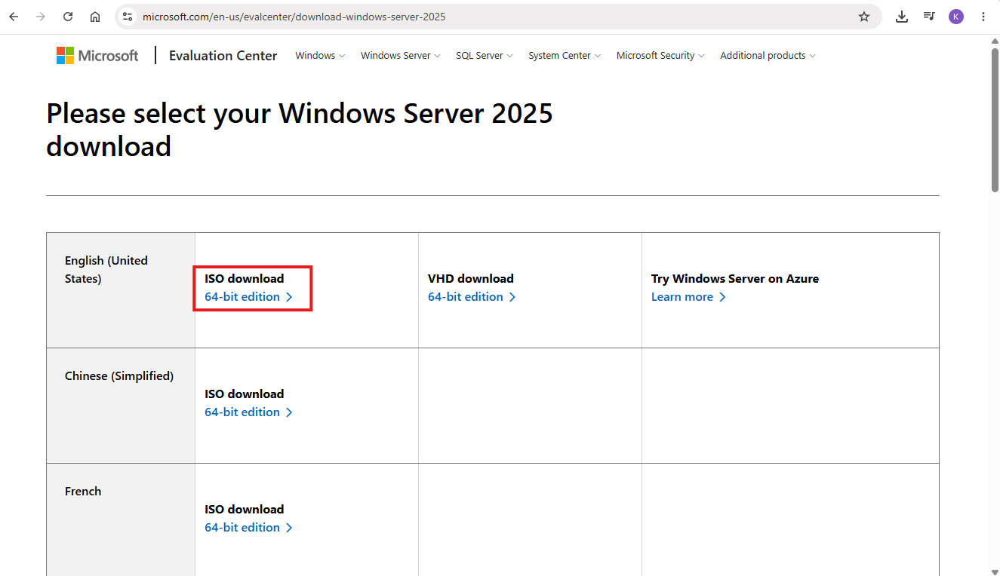
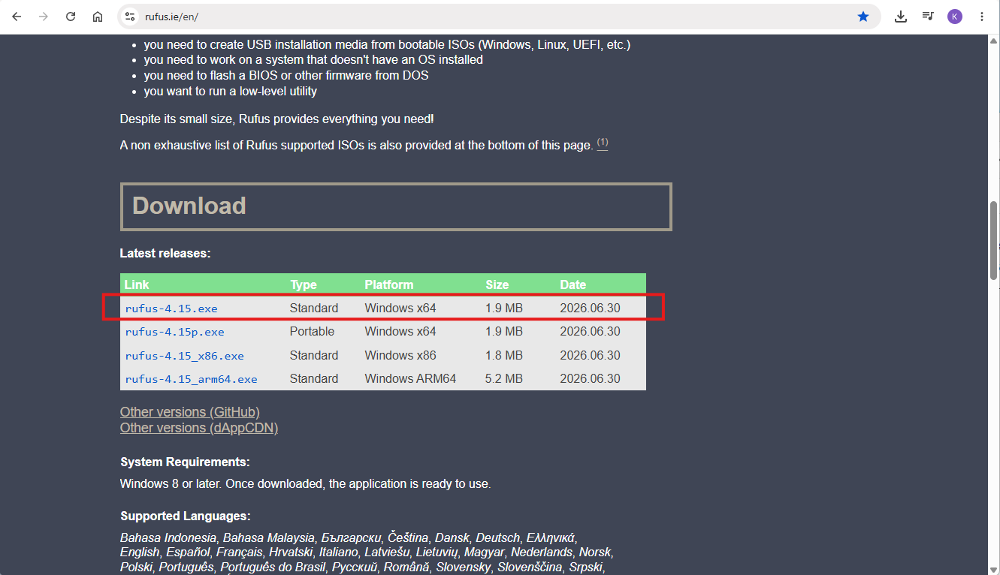
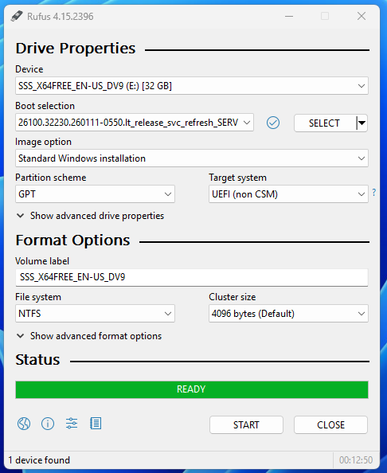
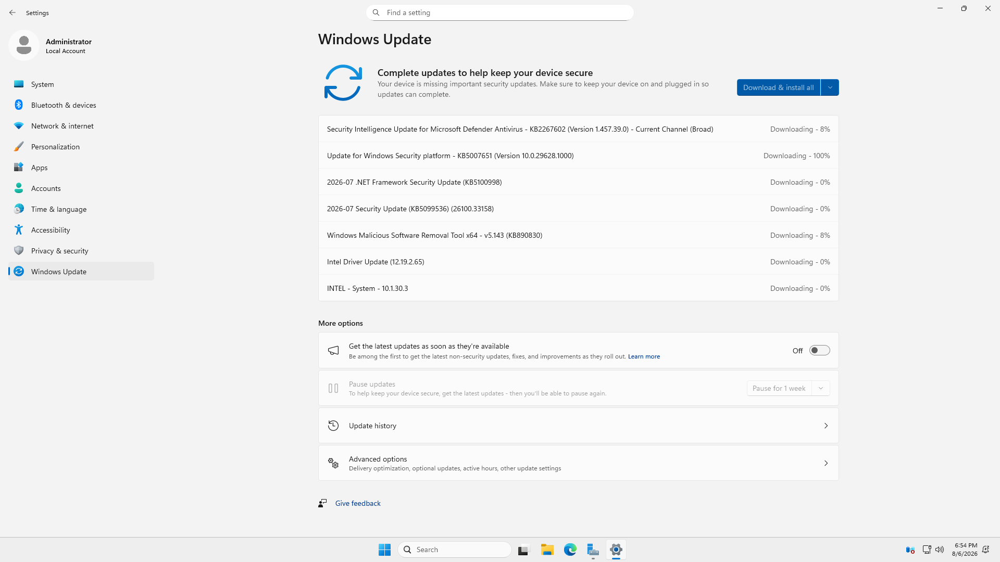

# Module 1 - Windows Server 2025 Installation

## Objective

Install Windows Server 2025 on the physical server and establish a stable operating system that will later be configured as the Hyper-V host for my home lab.

This module documents the preparation of the installation media, the Windows Server installation process, the troubleshooting encountered during installation, and the initial operating system updates.

# Skills Demonstrated

- Windows Server installation
- Bootable USB creation
- BIOS troubleshooting
- Storage troubleshooting
- Windows Update
- Technical documentation

# Technologies Used

| Technology | Purpose |
|------------|---------|
| Windows Server 2025 | Host operating system |
| Rufus | Bootable USB creation |
| UEFI BIOS | System firmware configuration |
| Intel VMD Controller | Storage controller configuration |
| NVMe SSD | Operating system installation |
| Windows Update | Operating system updates |

# Lab Environment

| Component | Specification |
|-----------|---------------|
| Processor | Intel Core i5-10500T |
| Memory | 32 GB RAM |
| Storage | 1 TB NVMe SSD |
| Operating System | Windows Server 2025 |

# Background

Windows Server provides the foundation for enterprise infrastructure services such as virtualization, Active Directory Domain Services, Domain Name System (DNS), Dynamic Host Configuration Protocol (DHCP), file services, and centralized management.

Before configuring these services, the operating system must first be installed correctly and verified to be functioning properly.

# Procedure

## Step 1 - Download Windows Server 2025 ISO

### Purpose

Obtain the official Windows Server installation media.

### Actions Performed

- Downloaded the [Windows Server 2025 ISO](https://www.microsoft.com/en-us/evalcenter/download-windows-server-2025).
- Verified that the ISO would be used to create the installation media.

### Screenshot

## Step 2 - Create Bootable USB

### Purpose

Create a bootable USB drive containing the Windows Server 2025 installation media.

### Actions Performed

- Used [Rufus](https://rufus.ie/en/#download) to create a bootable Windows Server installation USB.
- Prepared the USB drive for operating system installation.

### My Experience

During a previous Windows 11 installation on my companion's desktop computer, I selected **Rufus Portable** because I assumed it was the better version.

During that installation, I encountered several problems and later realized that I had misunderstood the purpose of the Portable edition. After reviewing the differences between the two versions of Rufus, I concluded that my choice of edition did not match my actual use case.

### What I Learned

For my personal workflow, **Rufus Standard** is the better choice because I create bootable USB drives on my own computer and do not need Rufus to preserve its settings across multiple computers.

I learned that:

- **Rufus Standard** is the recommended edition for most users creating bootable USB drives on a single computer.
- **Rufus Portable** is intended for users who frequently use Rufus on multiple computers while keeping the same application settings.

The difference between the two editions is based on portability and configuration storage rather than installation performance.

### Reflection

Reviewing my previous Windows installation also taught me that installation issues are not always caused by the software itself. Understanding the installation workflow and selecting the appropriate tool are equally important.

### Lesson Learned

This experience reminded me to understand the purpose of the tools I use instead of selecting them based on assumptions.

### Screenshot

## Step 3 - Boot from the Installation Media

### Purpose

Start the Windows Server installation using the bootable USB.

### Actions Performed

- Booted the computer using the Windows Server installation USB.
- Started the Windows Setup process.

## Step 4 - Troubleshoot Storage Detection

### Problem

Windows Setup could not detect the NVMe SSD.

### Investigation

Instead of assuming the SSD was faulty, I reviewed the BIOS configuration.

I found that the **Intel VMD Controller** was enabled.

### Resolution

- Disabled Intel VMD Controller.
- The SATA Controller Mode option became available.
- Changed the storage controller mode to **AHCI**.
- Restarted Windows Setup.

After updating the BIOS configuration, Windows Setup successfully detected the SSD.

### Lesson Learned

This experience taught me that storage detection problems can be caused by BIOS storage controller settings rather than hardware failure.

## Step 5 - Install Windows Server

### Purpose

Install Windows Server 2025 on the detected NVMe SSD.

### Actions Performed

- Selected the installation drive.
- Completed the Windows Server installation.
- Created the initial Administrator account.
- Successfully logged in to Windows Server.

> **Note**
>
> I do not have screenshots of the Windows installation wizard because screenshots cannot be captured during the operating system installation process.

## Step 6 - Install Windows Updates

### Purpose

Update Windows Server before installing additional roles or features.

### Actions Performed

- Connected the server to the Internet.
- Installed the latest available Windows Updates.
- Restarted the server when required.

Keeping Windows updated provides a stable and secure foundation before configuring additional Windows Server roles.

### Screenshot

# Verification

The installation was verified by confirming that:
- Windows Server installed successfully.
- The NVMe SSD was detected after updating the BIOS configuration.
- Windows booted normally.
- Internet connectivity was available.
- Windows Update completed successfully.

# Problems Encountered

| Problem | Cause | Resolution |
|---------|-------|------------|
| Windows Setup could not detect the NVMe SSD | Intel VMD Controller enabled | Disabled Intel VMD Controller and changed the storage controller mode to AHCI |

# Lessons Learned

During this module, I gained several practical lessons that improved my understanding of Windows Server installation.

### Selecting the Appropriate Rufus Edition

I initially believed that Rufus Portable was the better option. After reviewing my previous installation experience, I learned that Rufus Standard is the more appropriate choice for my personal workflow.

### BIOS Configuration Can Affect Windows Installation

I learned that BIOS settings directly affect whether Windows Setup can detect storage devices.

### Intel VMD Controller

I learned that Intel VMD is designed for specific storage configurations but may require additional drivers during Windows installation.

For my lab environment, disabling Intel VMD and using AHCI allowed Windows Setup to recognize the NVMe SSD successfully.

### Troubleshooting Before Reinstalling

Rather than immediately assuming hardware failure, I learned the importance of checking BIOS settings first.

This experience reinforced the value of understanding the installation process before attempting more complex troubleshooting.

# Best Practices

- Download installation media from official Microsoft sources.
- Select the appropriate Rufus edition for the intended workflow.
- Verify BIOS storage settings before assuming hardware failure.
- Install Windows Updates before configuring additional server roles.
- Document installation issues and their resolutions for future reference.

# Real-World Relevance

Installing Windows Server is a fundamental responsibility of system administrators. In production environments, administrators must not only deploy operating systems but also troubleshoot hardware detection issues, verify firmware configuration, and ensure that servers are stable before deploying infrastructure services.

This module demonstrates the importance of systematic troubleshooting and documenting deployment decisions during server installation.

# Summary

In this module, I successfully installed Windows Server 2025 on the physical server, resolved a storage detection issue caused by the Intel VMD Controller, and updated the operating system.

Completing this module established the foundation for building the Windows Server home lab.

# Next Module

**Module 2 - Prepare the Hyper-V Host**

This module will cover:
- Renaming the server to **HV01**
- Creating dedicated storage partitions
- Installing Hyper-V
- Configuring Hyper-V default storage
- Creating the External and Internal virtual switches