# Module 2 - Prepare the Hyper-V Host

> **Module Overview**
>
> This module prepares the physical Windows Server to function as the Hyper-V host for the home lab. The preparation includes organizing the storage, renaming the server, installing the Hyper-V role, configuring Hyper-V settings, and creating the required virtual switches before deploying virtual machines.

# Objective

Prepare the physical Windows Server to host multiple virtual machines for the home lab by configuring the operating system and Hyper-V environment.

# Skills Demonstrated

- Windows Server administration
- Computer renaming
- Storage organization
- Hyper-V installation
- Hyper-V configuration
- Virtual networking
- Troubleshooting
- Technical documentation

# Technologies Used

| Technology | Purpose |
|------------|---------|
| Windows Server 2025 | Hyper-V host operating system |
| Hyper-V | Server virtualization platform |
| Server Manager | Install Windows Server roles and features |
| Hyper-V Manager | Manage virtual machines and virtual switches |
| Disk Management | Organize storage partitions |

# Lab Environment

| Component | Specification |
|-----------|---------------|
| Computer Name | HV01 |
| Operating System | Windows Server 2025 |
| Hypervisor | Microsoft Hyper-V |
| Processor | Intel Core i5-10500T |
| Memory | 32 GB RAM |
| Storage | 1 TB NVMe SSD |

# Prerequisites

Before beginning this module, I completed:

- Windows Server 2025 installation
- Windows Update
- Internet connectivity verification

# Procedure

## Step 1 - Rename the Physical Server

### Purpose

Assign a meaningful computer name before deploying the virtualization environment.

### Actions Performed

Renamed the physical server from the default Windows-generated computer name:

```
WIN-UR426DO4PPL
```

to

```
HV01
```

### Why I Chose HV01

I followed a simple naming convention for consistency throughout the lab.

- **HV** = Hyper-V Host
- **01** = First Hyper-V server in the environment

Using descriptive computer names makes the environment easier to identify and manage as additional servers and virtual machines are added.

### Screenshot

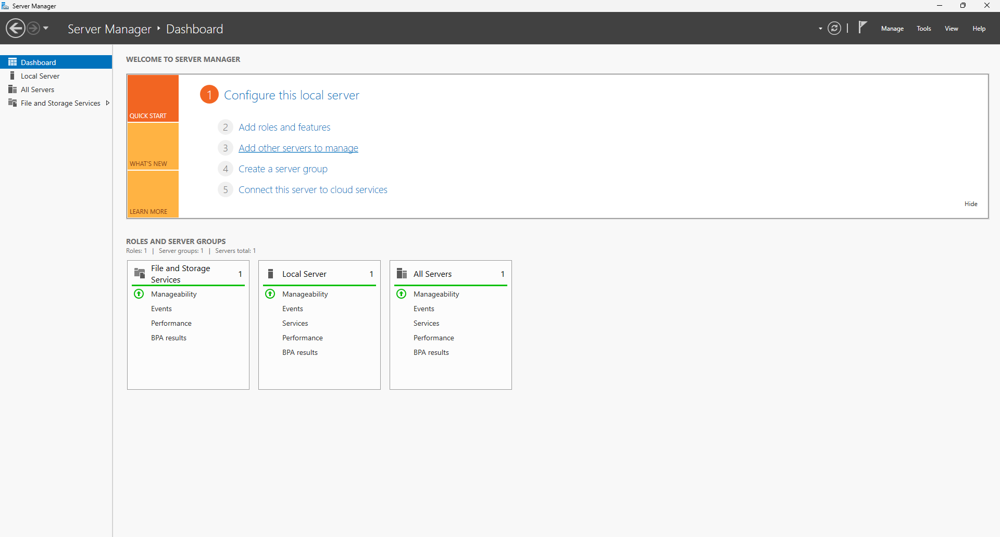

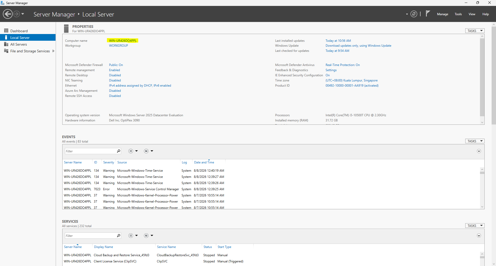

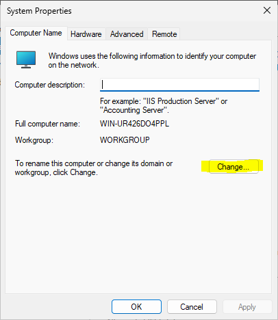

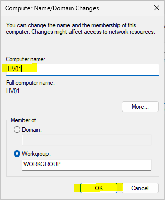

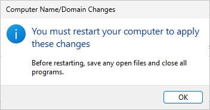

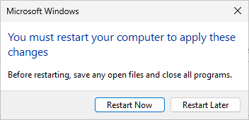

## Step 2 - Organize the Storage

### Purpose

Prepare the storage before creating virtual machines.

### Actions Performed

After Windows Server was installed, I organized the storage into dedicated partitions and created folders to separate operating system files, virtual machines, and lab resources.

| Drive | Label | Purpose |
|-------|--------|---------|
| C: | System | Windows Server operating system |
| D: | Lab | Hyper-V virtual machines and lab files |
| E: | Resources | ISO files, drivers, scripts, screenshots, and documentation |

I also created folders to organize the lab resources before deploying any virtual machines.

### Technical Note - Using Shrink Volume

While creating the storage partitions, I learned how the **Shrink Volume** feature in Disk Management calculates partition sizes.

The value entered in the **"Enter the amount of space to shrink in MB"** field represents the amount of storage to remove from the selected partition, **not** the final size of that partition.

My approach was:

1. Calculate how much space I wanted to remain on the current partition.
2. Enter the amount of space to shrink based on the remaining available storage.
3. Create a new partition using the unallocated space.
4. Repeat the process for the next partition until the desired storage layout was completed.

Understanding this process helped me plan the storage layout more accurately and avoid creating partitions with incorrect sizes.

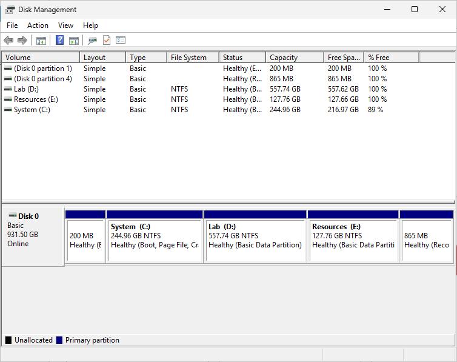

*Figure 2.1. Storage Partition.*

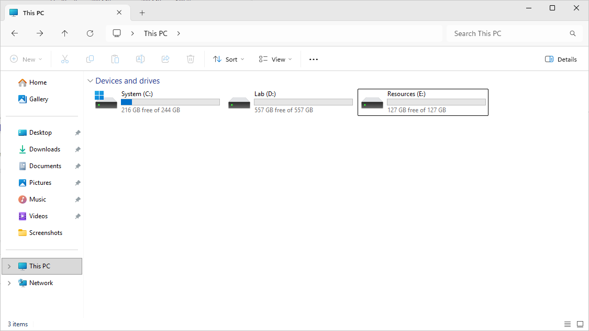

*Figure 2.1. File Explorer.*

### Example

Suppose the drive has **1 TB** of available space and I want to keep **300 GB** for the system partition.

Instead of entering **300 GB**, I need to calculate how much storage should be removed from the partition. The value entered into **Shrink Volume** is always the amount of space to remove, not the desired final partition size.

This was one of the practical lessons I learned while organizing the storage for my home lab.

### Why I Did This

Separating the operating system from virtual machines and documentation keeps the environment organized and simplifies future maintenance.

## Step 3 - Install the Hyper-V Role

### Prerequisite Verification

Before installing the Hyper-V role, I verified that hardware virtualization was enabled using **Task Manager → Performance → CPU**.

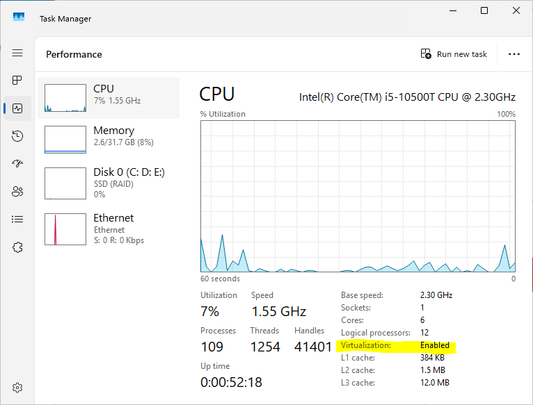

*Figure 3.1. Task Manager confirming that hardware virtualization is enabled.*

> **Technical Note**
>
> Hardware virtualization can also be verified through the BIOS/UEFI firmware settings or by using the `systeminfo` command or PowerShell. For this lab, I verified it using Task Manager.

### Step 3.1 - Open the Add Roles and Features Wizard

To begin the installation:

1. Opened **Server Manager**.
2. Selected **Manage**.
3. Clicked **Add Roles and Features**.

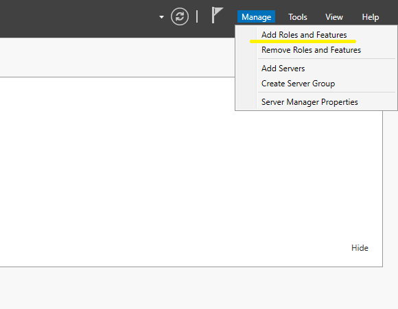

*Figure 3.1.1 Opening the Add Roles and Features Wizard.*

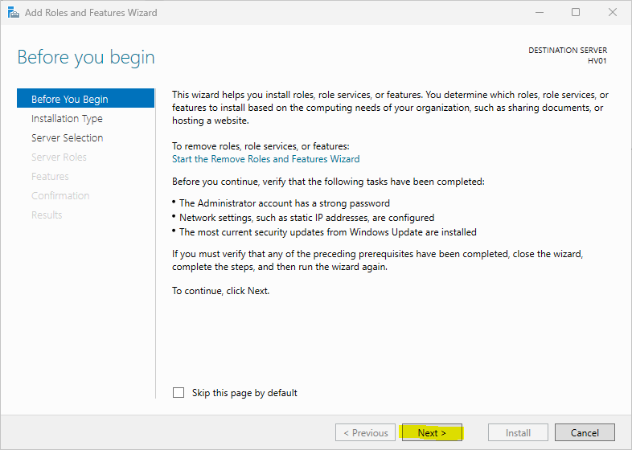

*Figure 3.1.2 Opening the Add Roles and Features Wizard.*

### Step 3.2 - Installation Type

Selected:

- **Role-based or feature-based installation**

This option is used to install roles directly on a Windows Server.

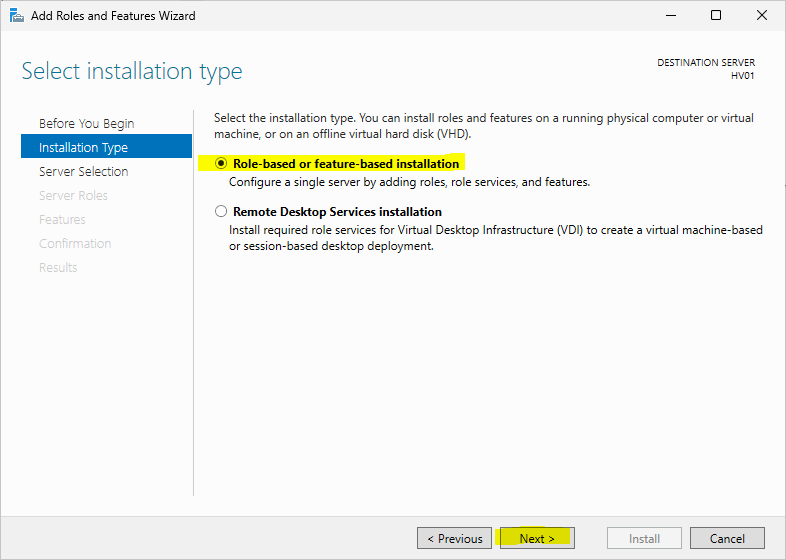

*Figure 3.2. Selecting the installation type.*

### Step 3.3 - Select the Destination Server

Selected **HV01** as the destination server.

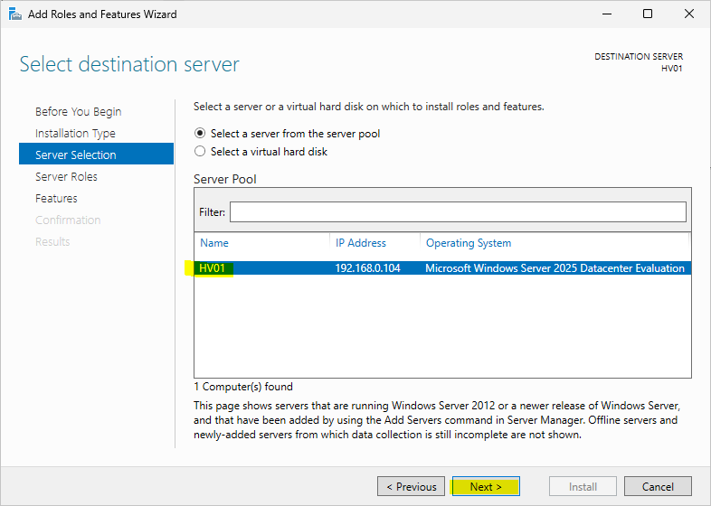

*Figure 3.3. Selecting HV01 as the destination server.*

### Step 3.4 - Select the Hyper-V Role

Selected the **Hyper-V** role.

Accepted the required management tools and additional features when prompted.

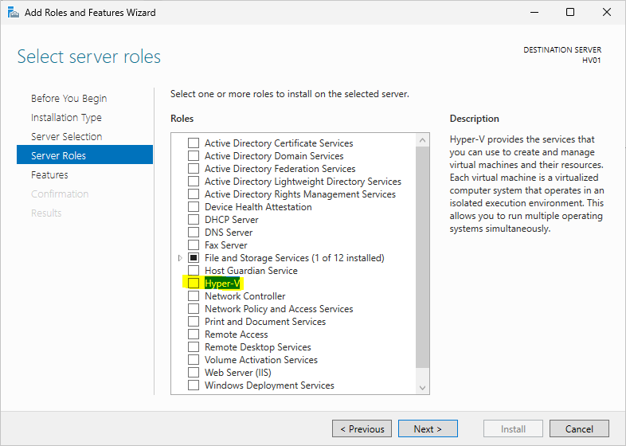

*Figure 3.4.1 Selecting the Hyper-V role.*

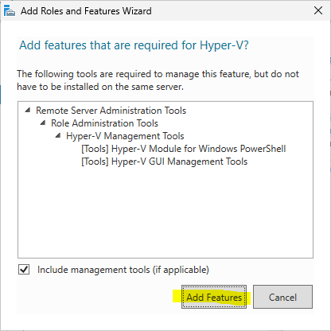

*Figure 3.4.2 Adding Features*

### Step 3.5 - Configure the Virtual Switch

Selected the physical Ethernet adapter to automatically create an External Virtual Switch.

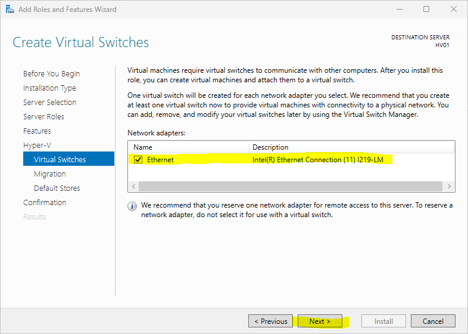

*Figure 3.5. Selecting the physical Ethernet adapter.*

### Step 3.6 - Configure Live Migration

Kept the default Live Migration settings because this feature was not required for the current lab environment.

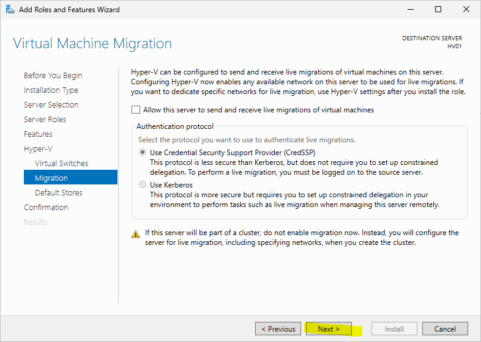

*Figure 3.6. Using the default Live Migration configuration.*

### Step 3.7 - Configure Default Stores

Configured the default storage locations to use the folders created under:

- `D:\Lab\Hyper-V\Virtual Hard Disks`
- `D:\Lab\Hyper-V\Virtual Machines`

This keeps virtual machine files separate from the operating system.

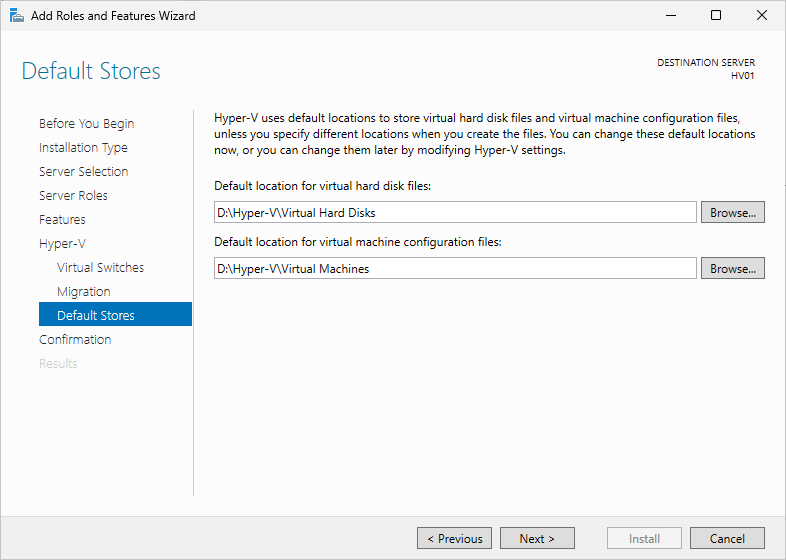

*Figure 3.7. Configuring the default storage locations.*

### Step 3.8 - Complete the Installation

Reviewed the configuration summary, completed the installation, and restarted the server when prompted.

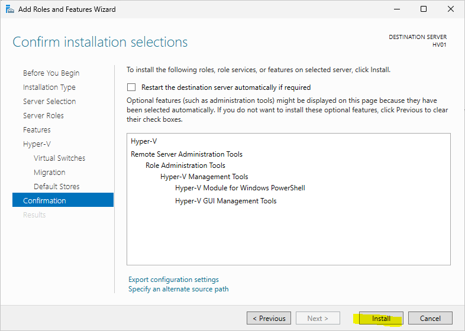

*Figure 3.8.1 Hyper-V confirm nstallation.*

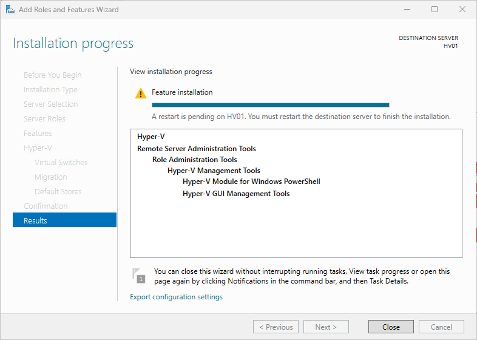

*Figure 3.8.2 Hyper-V installation completed successfully.*

## Step 4 - Configure Hyper-V Settings

### Purpose

Configure the default locations used by Hyper-V before creating virtual machines.

### Open Hyper-V Manager

To access the Hyper-V management console:

1. Open **Server Manager**.
2. Select **Tools**.
3. Click **Hyper-V Manager**.
4. In the left pane, right-click **HV01**.
5. Select **Hyper-V Settings**.


*Figure 4.1. Opening Hyper-V Manager from Server Manager.*


*Figure 4.2. Accessing the Hyper-V Settings for HV01.*

### Configure the Default Storage Locations

Configured:

- Default Virtual Machine location

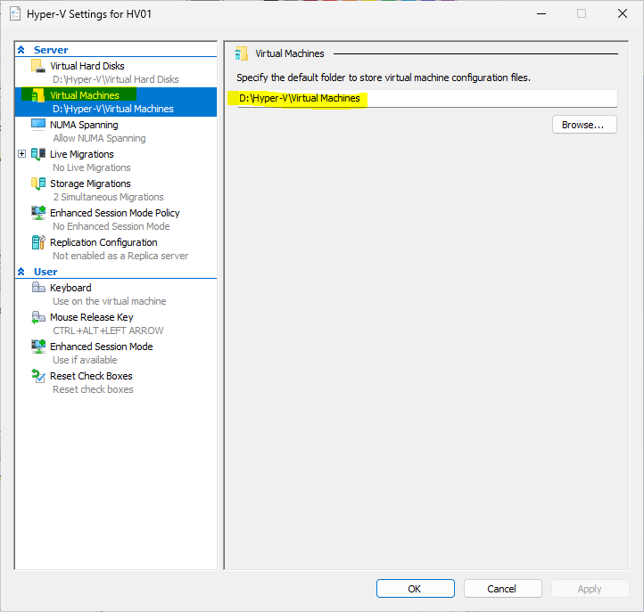

*Figure 4.3.1 Verifying default virtual machines folder.*

- Default Virtual Hard Disk location

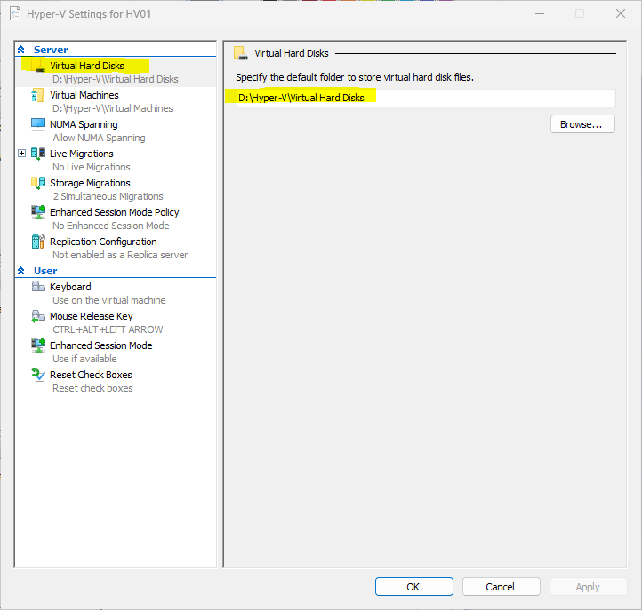

*Figure 4.3.2 Verifying default virtual hard disks folder.*

These settings ensure that newly created virtual machines are stored in the appropriate location instead of the system drive.

## Step 5 - Create the Virtual Switches

### Purpose

Prepare the virtual networking environment for future virtual machines.

### Actions Performed

Created:

- External Virtual Switch
- Internal Virtual Switch

The External Virtual Switch provides virtual machines with access to the physical network through the host's physical network adapter.

The Internal Virtual Switch allows communication between the host operating system and virtual machines without directly exposing them to the physical network.

### Screenshots

images/05-external-switch.png

images/06-internal-switch.png

## Step 6 - Troubleshoot the Virtual Switch Error

### Problem

While creating the External Virtual Switch, Hyper-V displayed the following error:

> External Ethernet adapter is already bound to the Microsoft Virtual Switch protocol.

### Cause

The physical network adapter was already associated with an existing External Virtual Switch.

Since a physical network adapter can only be bound to one External Virtual Switch at a time, Hyper-V prevented the creation of another External Virtual Switch using the same adapter.

### Resolution

Instead of creating another External Virtual Switch, I used the existing switch by renaming it to match my naming convention.

### Lesson Learned

I learned that one physical network adapter can only be associated with one External Virtual Switch.

### Screenshot

images/07-virtual-switch-error.png

# Verification

The preparation was verified by confirming that:

- The computer name was successfully changed to **HV01**.
- Storage partitions were created successfully.
- Lab folders were organized.
- Hyper-V was installed successfully.
- Hyper-V Manager opened successfully.
- Hyper-V Settings were configured.
- External Virtual Switch created successfully.
- Internal Virtual Switch created successfully.

# Problems Encountered

| Problem | Cause | Resolution |
|---------|-------|------------|
| Unable to create another External Virtual Switch | Physical adapter already bound to Microsoft Hyper-V Virtual Switch protocol | Used the existing switch and renamed it |

# Lessons Learned

### Hyper-V

I learned that Hyper-V is a Windows Server role that enables a physical server to create, run, and manage multiple virtual machines on the same hardware.

### External Virtual Switch

I learned that an External Virtual Switch connects virtual machines to the physical network by using a physical network adapter.

### Internal Virtual Switch

I learned that an Internal Virtual Switch allows communication between the host operating system and virtual machines without requiring access to the physical network.

### Storage Organization

I learned that organizing storage before creating virtual machines helps separate the operating system, virtual machines, and documentation, making the environment easier to maintain.

### Naming Convention

Using meaningful computer names such as **HV01** makes the lab easier to understand and manage as more servers are added.

### Troubleshooting

I learned that understanding how Hyper-V uses physical network adapters is important when configuring virtual networking.

# Best Practices

- Rename servers using a consistent naming convention.
- Organize storage before deploying virtual machines.
- Configure Hyper-V settings before creating virtual machines.
- Plan the virtual networking architecture before deployment.
- Document configuration changes and troubleshooting steps.

# Real-World Relevance

Preparing a Hyper-V host is one of the first responsibilities when deploying a virtualization environment.

Before any production virtual machines are created, administrators organize storage, configure Hyper-V, prepare virtual networking, and verify that the host is ready to support future workloads.

# Summary

In this module, I prepared the Windows Server host for virtualization by organizing the storage, renaming the server, installing the Hyper-V role, configuring Hyper-V settings, and creating the required virtual switches.

Completing these tasks established a stable Hyper-V host that is ready for deploying the first virtual machine.

# Next Module

**Module 3 – Create the DC01 Virtual Machine**

In the next module, I will create the first Windows Server virtual machine, which will later become the domain controller for the home lab.