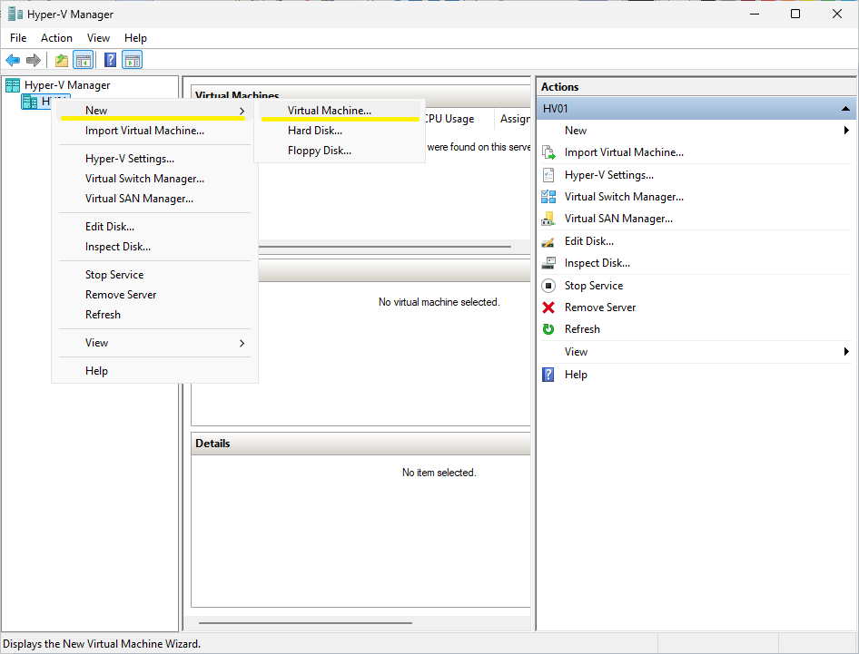
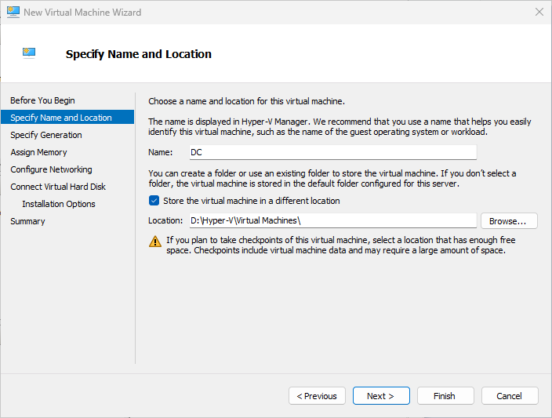
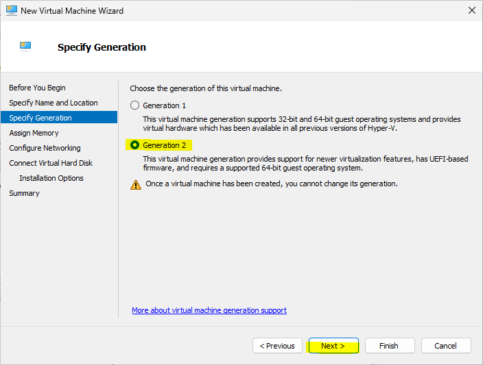
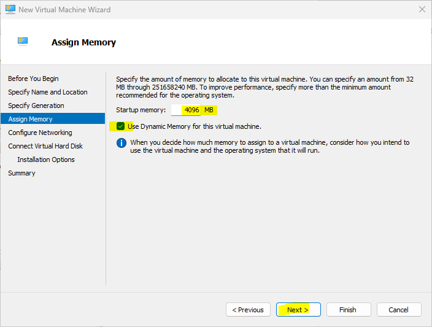
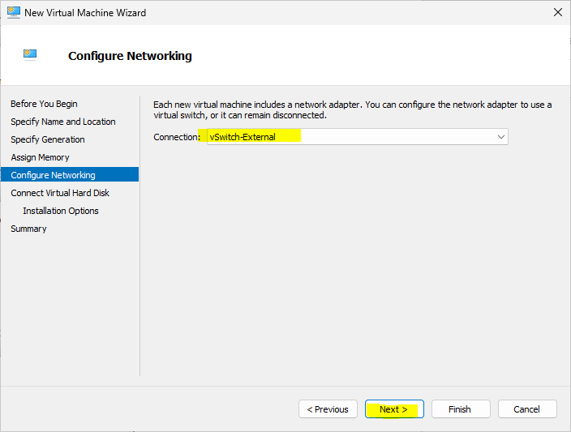
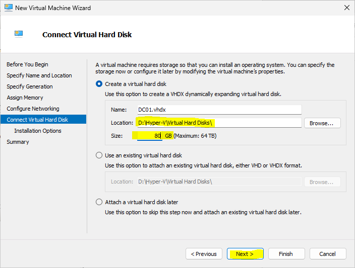
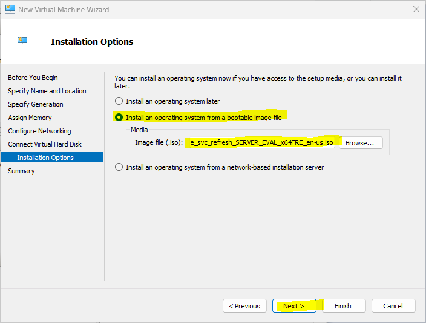
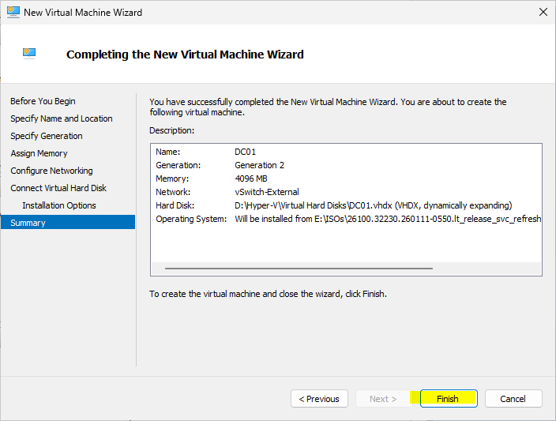
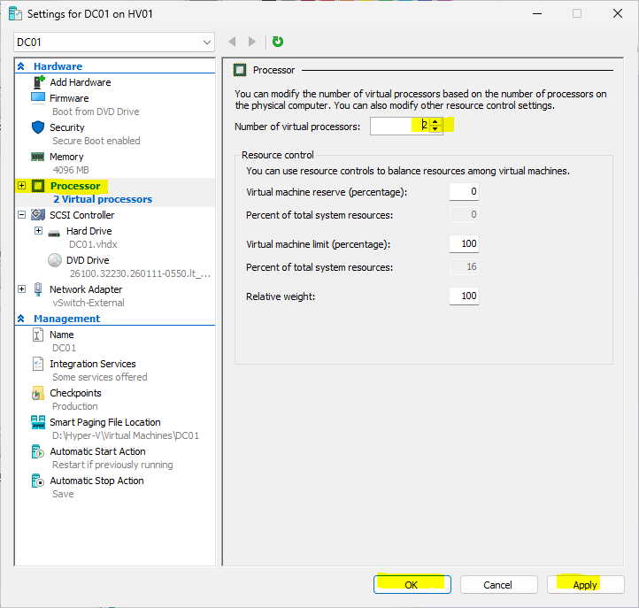

# Module 3 - Create the DC01 Virtual Machine

> **Module Overview**
>
> This module covers the creation and initial hardware configuration of the first virtual machine in the home lab. The virtual machine, **DC01**, will serve as the future Domain Controller and will later host Active Directory Domain Services (AD DS), Domain Name System (DNS), and other Windows Server roles.

# Objective

Create and configure the first Windows Server virtual machine that will later become the Domain Controller for the home lab.

# Skills Demonstrated

- Hyper-V virtual machine deployment
- Virtual hardware configuration
- Virtual networking
- Virtual storage planning
- Hyper-V administration
- Infrastructure planning
- Technical documentation

# Technologies Used

| Technology | Purpose |
|------------|---------|
| Windows Server 2025 | Guest operating system |
| Microsoft Hyper-V | Virtualization platform |
| Hyper-V Manager | Virtual machine management |
| VHDX | Virtual hard disk format |
| Generation 2 Virtual Machine | Modern virtual machine firmware |

# Lab Environment

| Component | Value |
|-----------|-------|
| Host Server | HV01 |
| Guest Virtual Machine | DC01 |
| Hypervisor | Microsoft Hyper-V |
| Operating System | Windows Server 2025 |
| Virtual Hard Disk | VHDX |
| Virtual Switch | vSwitch-External |

# Prerequisites

Before beginning this module, I completed:

- Windows Server installation
- Hyper-V installation
- Hyper-V configuration
- Storage organization
- Virtual switch configuration

# Procedure

## Step 1 - Open the New Virtual Machine Wizard

### Purpose

Start the virtual machine creation process using Hyper-V Manager.

### Actions Performed

1. Opened **Server Manager**.
2. Selected **Tools**.
3. Opened **Hyper-V Manager**.
4. Selected **HV01**.
5. Clicked **New** → **Virtual Machine**.

*Figure 3.1. Opening the New Virtual Machine Wizard.*

## Step 2 - Configure the Virtual Machine Identity

### Purpose

Assign a meaningful name and storage location for the virtual machine.

### Configuration

| Setting | Value | Reason |
|---------|-------|--------|
| Name | DC01 | Identifies the first Domain Controller in the home lab. |
| Location | D:\Lab\Hyper-V\Virtual Machines | Uses the dedicated Lab partition prepared in Module 2. |

### Why I Chose DC01

I followed a consistent naming convention throughout the lab.

- **DC** = Domain Controller
- **01** = First Domain Controller

Using meaningful names makes the environment easier to organize and manage as more virtual machines are added.

*Figure 3.2. Configuring the virtual machine name and storage location.*

## Step 3 - Configure the Virtual Machine Generation

### Purpose

Select the virtual machine firmware generation.

### Configuration

| Setting | Value | Reason |
|---------|-------|--------|
| Generation | Generation 2 | Recommended for Windows Server 2025 and supports UEFI and Secure Boot. |

### Why I Chose Generation 2

I selected **Generation 2** because it is the recommended option for Windows Server 2025. It supports modern virtualization features such as UEFI firmware and Secure Boot.

I also learned that the virtual machine generation cannot be changed after creation, making it important to choose the correct option during the initial setup.

*Figure 3.3. Selecting Generation 2.*

## Step 4 - Configure Memory

### Purpose

Allocate memory resources for the virtual machine.

### Configuration

| Setting | Value | Reason |
|---------|-------|--------|
| Startup Memory | 4096 MB | Provides sufficient memory while preserving host resources. |
| Dynamic Memory | Enabled | Allows Hyper-V to optimize memory allocation based on workload. |

### Why I Enabled Dynamic Memory

Dynamic Memory allows Hyper-V to adjust the memory allocated to the virtual machine based on its workload.

This helps optimize memory usage and allows the Hyper-V host to manage available resources more efficiently.

*Figure 3.4. Configuring the startup memory.*

## Step 5 - Configure Networking

### Purpose

Connect the virtual machine to the network.

### Configuration

| Setting | Value | Reason |
|---------|-------|--------|
| Virtual Switch | vSwitch-External | Allows the virtual machine to communicate with the physical network and access the Internet when required. |

### Why I Chose the External Virtual Switch

I selected **vSwitch-External** so the virtual machine could communicate with the physical network and access the Internet during Windows installation and future lab activities.

*Figure 3.5. Selecting the External Virtual Switch.*

## Step 6 - Configure the Virtual Hard Disk

### Purpose

Create the storage that will contain the Windows Server operating system.

### Configuration

| Setting | Value | Reason |
|---------|-------|--------|
| Name | DC01.vhdx | Uses a descriptive naming convention. |
| Location | D:\Lab\Hyper-V\Virtual Hard Disks | Follows the storage organization established in Module 2. |
| Size | 80 GB | Sufficient for the planned Windows Server roles while conserving physical storage. |

### Why I Chose an 80 GB Virtual Hard Disk

An 80 GB virtual hard disk provides sufficient storage for the Windows Server roles planned in this home lab while leaving additional storage available for future virtual machines.

*Figure 3.6. Configuring the virtual hard disk.*

## Step 7 - Select the Installation Media

### Purpose

Attach the Windows Server installation media.

### Configuration

| Setting | Value |
|---------|-------|
| Installation Media | Windows Server 2025 ISO |

I selected the Windows Server 2025 ISO so the virtual machine would be ready to begin the operating system installation immediately after creation.

*Figure 3.7. Selecting the Windows Server 2025 ISO.*

## Step 8 - Review and Create the Virtual Machine

### Purpose

Review the configuration before creating the virtual machine.

After verifying all configuration settings, I completed the New Virtual Machine Wizard.

*Figure 3.8. Reviewing the virtual machine configuration before creation.*

## Step 9 - Configure Virtual Machine Hardware

### Purpose

Review and adjust the virtual hardware configuration before installing Windows Server.

### Configure the Virtual Processor

After creating the virtual machine, I opened the **Settings** for **DC01** and adjusted the processor configuration.

I changed the virtual processor count from **6** to **2**.

### Why I Chose Two Virtual Processors

Two virtual processors provide sufficient processing power for a Windows Server domain controller while preserving CPU resources for the Hyper-V host and future virtual machines.

Allocating only the required resources helps maintain better overall performance as additional virtual machines are added to the lab.

*Figure 3.9. Configuring two virtual processors for DC01.*

### Verification

I verified that the virtual machine was configured with:

- 2 virtual processors
- 4096 MB startup memory
- Dynamic Memory enabled
- vSwitch-External connected
- 80 GB virtual hard disk
- Windows Server 2025 ISO attached

# Verification

The virtual machine was successfully created with the planned hardware configuration and was ready for Windows Server installation.

# Problems Encountered

No issues were encountered during the virtual machine creation process.

# Lessons Learned

### Naming Convention

Using meaningful virtual machine names makes the environment easier to organize and manage.

### Generation Selection

Generation 2 is the recommended option for Windows Server 2025 and cannot be changed after the virtual machine is created.

### Dynamic Memory

Dynamic Memory allows Hyper-V to allocate memory based on the workload, improving resource utilization.

### Virtual Networking

Using the External Virtual Switch provides network and Internet connectivity required for future lab activities.

### Resource Allocation

Allocating hardware resources based on the expected workload helps maintain overall host performance while supporting multiple virtual machines.

# Best Practices

- Use a consistent naming convention.
- Store virtual machines on a dedicated storage partition.
- Allocate only the hardware resources required.
- Verify all hardware settings before powering on a virtual machine.
- Review the virtual machine configuration before installing the operating system.

# Real-World Relevance

Creating a virtual machine is one of the first tasks performed when deploying a Windows Server infrastructure. Planning the virtual hardware, storage, networking, and resource allocation before installing the operating system helps ensure a stable and maintainable virtualization environment.

# Summary

In this module, I successfully created and configured the **DC01** virtual machine using Microsoft Hyper-V. The virtual machine was prepared with the required storage, networking, processor, memory, and installation media and is now ready for Windows Server 2025 installation.

# Next Module

**Module 4 – Install Active Directory Domain Services**

In the next module, I will install Windows Server 2025 on the DC01 virtual machine and prepare it for promotion to the first Domain Controller in the home lab.