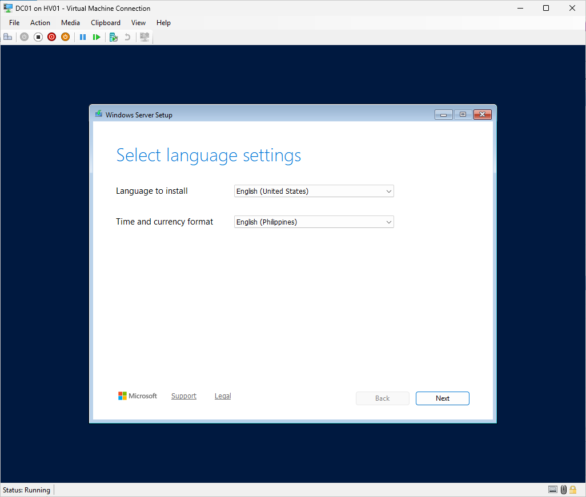
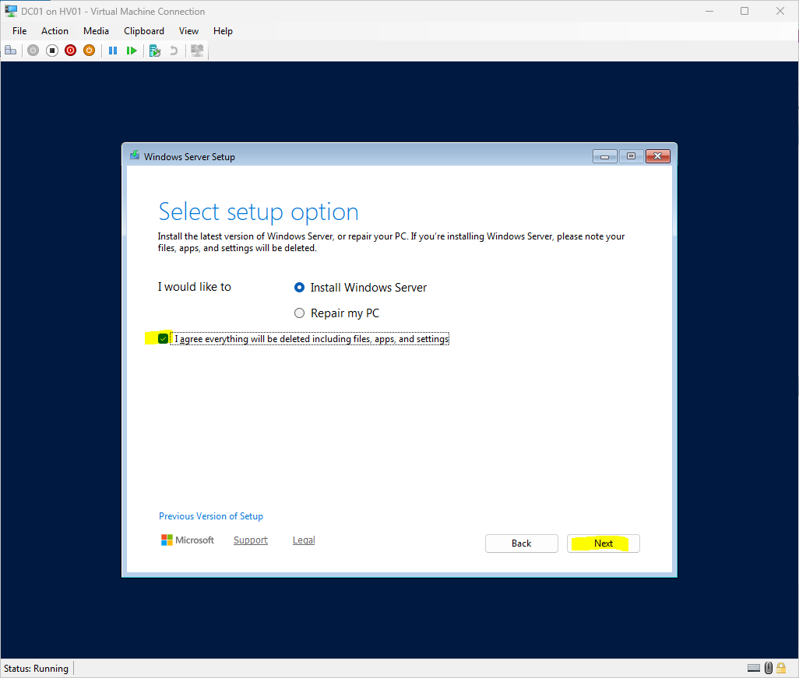
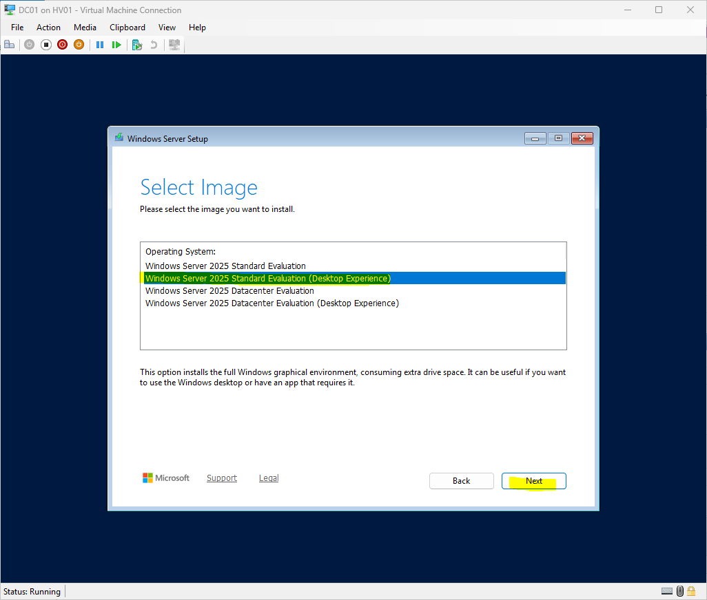
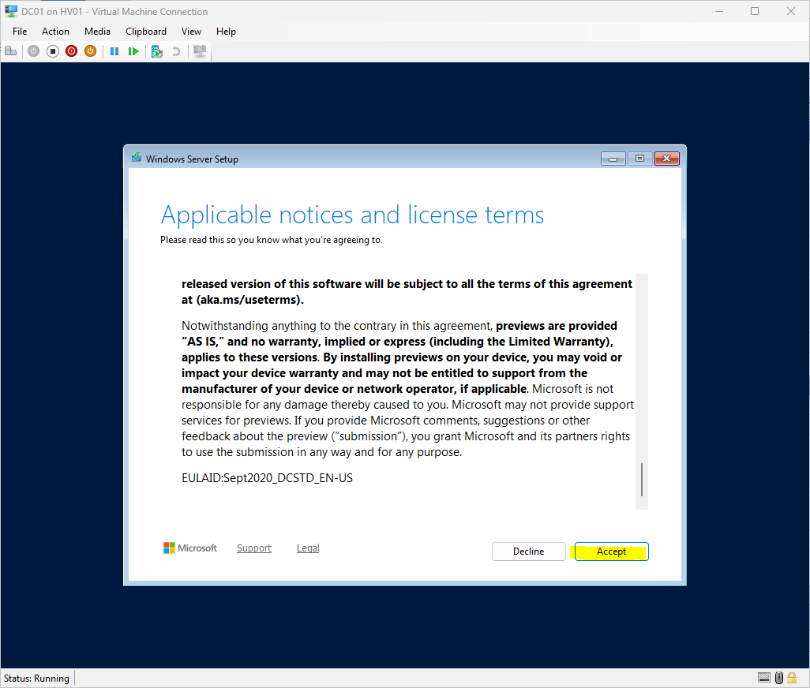
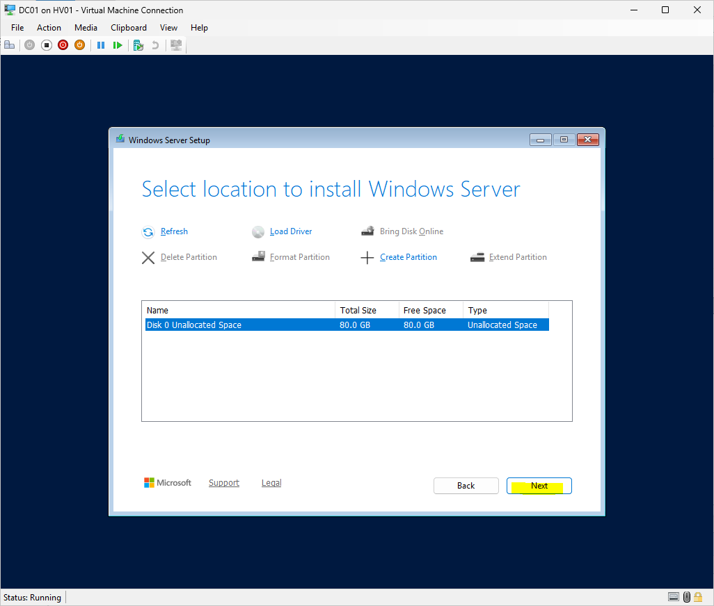
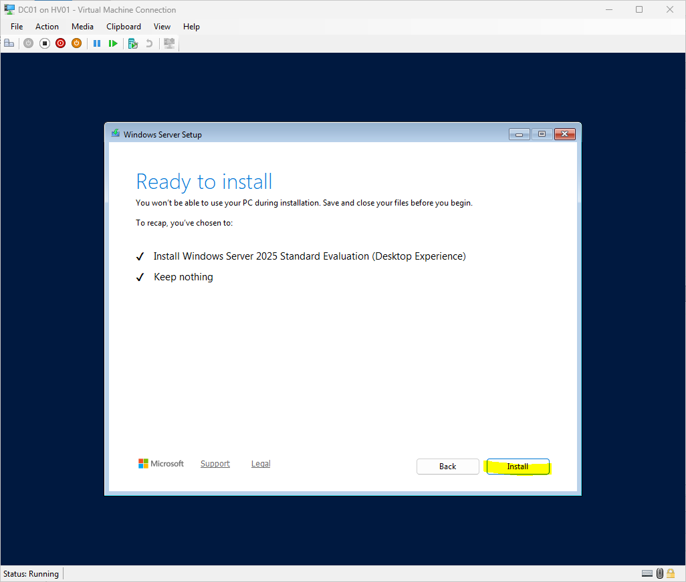
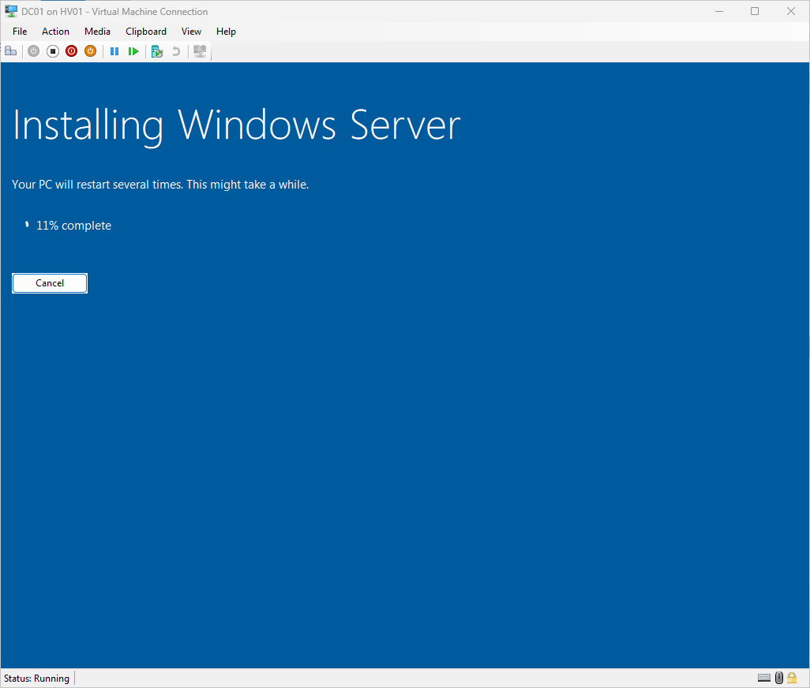
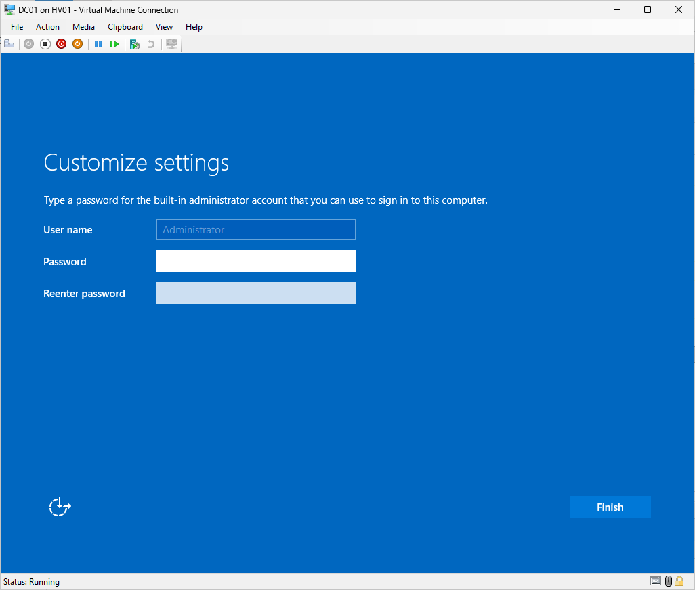
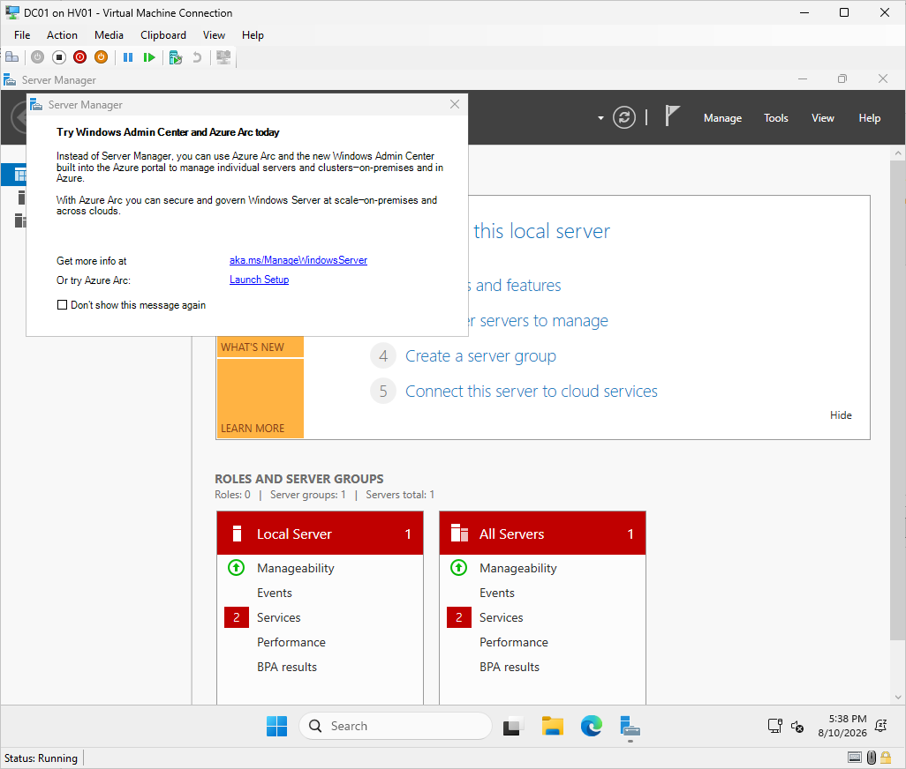

# Module 4 - Install Windows Server 2025 on DC01
> **Module Overview**
>
> This module covers the installation of Windows Server 2025 on the **DC01** virtual machine created in Module 3. The installation prepares the guest operating system for the initial server configuration and the future deployment of Active Directory Domain Services (AD DS).

# Objective
Install Windows Server 2025 on the **DC01** virtual machine and verify that the operating system is successfully installed and ready for initial configuration.

# Skills Demonstrated
- Windows Server installation
- Hyper-V virtual machine deployment
- Operating system deployment
- Virtual disk installation
- Windows Server setup
- Technical documentation

# Technologies Used
| Technology | Purpose |
|------------|---------|
| Windows Server 2025 Standard Evaluation (Desktop Experience) | Guest operating system |
| Microsoft Hyper-V | Virtualization platform |
| VHDX | Virtual hard disk |
| ISO Image | Operating system installation media |

# Lab Environment
| Component | Value |
|-----------|-------|
| Host Server | HV01 |
| Virtual Machine | DC01 |
| Operating System | Windows Server 2025 Standard Evaluation (Desktop Experience) |
| Installation Media | Windows Server 2025 ISO |
| Virtual Hard Disk | 80 GB VHDX |

# Prerequisites
Before beginning this module, I completed:

- Hyper-V host configuration
- DC01 virtual machine creation
- Virtual hardware configuration
- Windows Server 2025 ISO attachment

# Procedure
## Step 1 - Configure Windows Server Setup
### Purpose
Configure the initial Windows Server installation settings.

### Actions Performed
Configured the following installation settings:

- Language
- Time and currency format
- Keyboard or input method

*Figure 4.1. Configuring the Windows Server setup language and regional settings.*

## Step 2 - Select the Setup Option
### Purpose
Choose the setup action to perform.

### Actions Performed
On the Windows Server Setup screen, I selected:

- **Install Microsoft Server Operating System**

The **Repair my PC** option was not applicable because this was a new installation.

*Figure 4.2. Selecting the Windows Server installation option.*

## Step 3 - Select the Windows Server Edition
### Purpose
Choose the operating system edition to install.

### Configuration
| Setting | Value | Reason |
|---------|-------|--------|
| Edition | Windows Server 2025 Standard Evaluation (Desktop Experience) | Includes the graphical interface required for learning and administration. |

### Why I Chose Desktop Experience
I selected the **Desktop Experience** edition because it provides a graphical user interface, making it easier to learn Windows Server administration, navigate management tools, and create technical documentation.

*Figure 4.3. Selecting the Windows Server edition.*

## Step 4 - Accept the License Agreement
### Purpose
Accept the Microsoft Software License Terms before continuing with the installation.

*Figure 4.4. Accepting the Microsoft Software License Terms.*

## Step 5 - Select the Installation Disk
### Purpose
Choose the destination disk for the Windows Server installation.

### Configuration
| Setting | Value | Reason |
|---------|-------|--------|
| Installation Disk | Drive 0 - Unallocated Space (80 GB) | Uses the virtual hard disk created in Module 3. |

### Why I Chose This Disk
The 80 GB virtual hard disk was created specifically for the DC01 virtual machine. Since it was a new virtual disk, Windows Setup automatically created the required system partitions during installation.

*Figure 4.5. Selecting the installation disk.*

## Step 6 - Ready to Install
### Purpose
Review the selected configuration before Windows Server installation begins.

After verifying the selected edition and installation disk, I proceeded with the installation.

*Figure 4.6. Reviewing the installation settings before continuing.*

## Step 7 - Install Windows Server
### Purpose
Install the Windows Server operating system.

Windows Server Setup completed the following tasks:

- Copying Windows files
- Installing features
- Installing updates
- Finishing the installation

The virtual machine restarted automatically after the installation completed.

*Figure 4.7. Windows Server installation in progress.*

## Step 8 - Create the Administrator Password
### Purpose
Configure the local Administrator account password.

After Windows Server finished installing, I created the password for the built-in Administrator account.

> **Security Note**
>
> The Administrator password is intentionally omitted from this documentation.

*Figure 4.8. Creating the Administrator password.*

## Step 9 - Verify the Installation
### Purpose
Confirm that Windows Server installed successfully.

### Verification
I verified that:

- Windows Server booted successfully.
- I was able to sign in as Administrator.
- Server Manager opened automatically.
- Internet connectivity was available.
- The computer was assigned the default Windows-generated computer name.

*Figure 4.9. Verifying the successful Windows Server installation.*