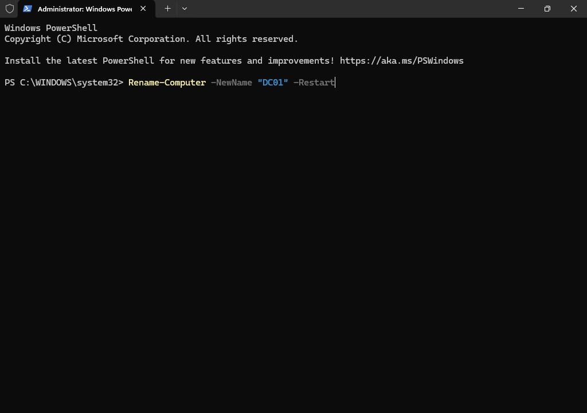
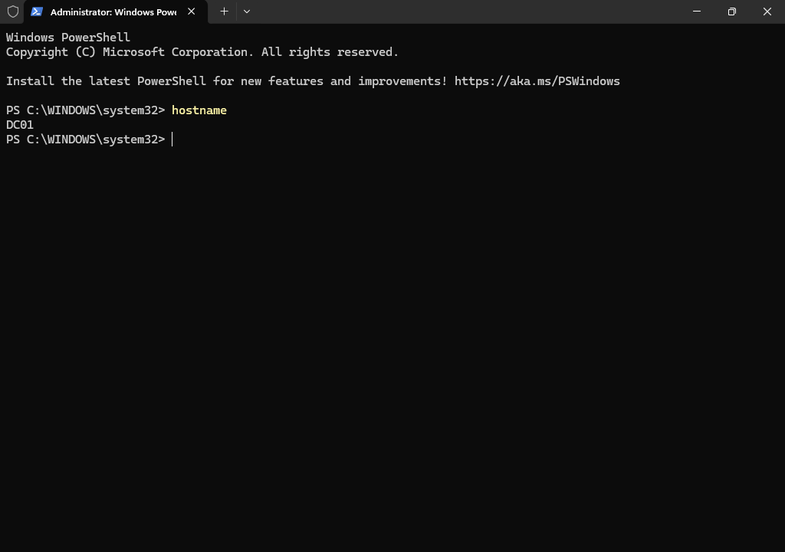
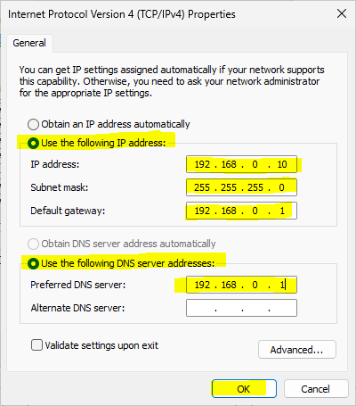
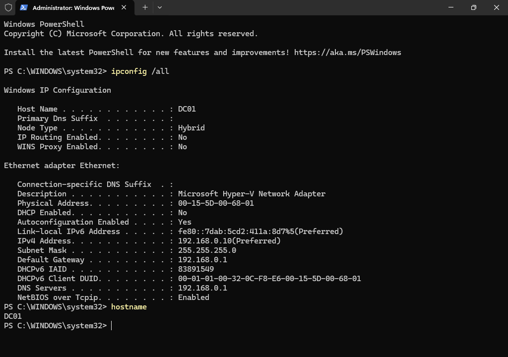
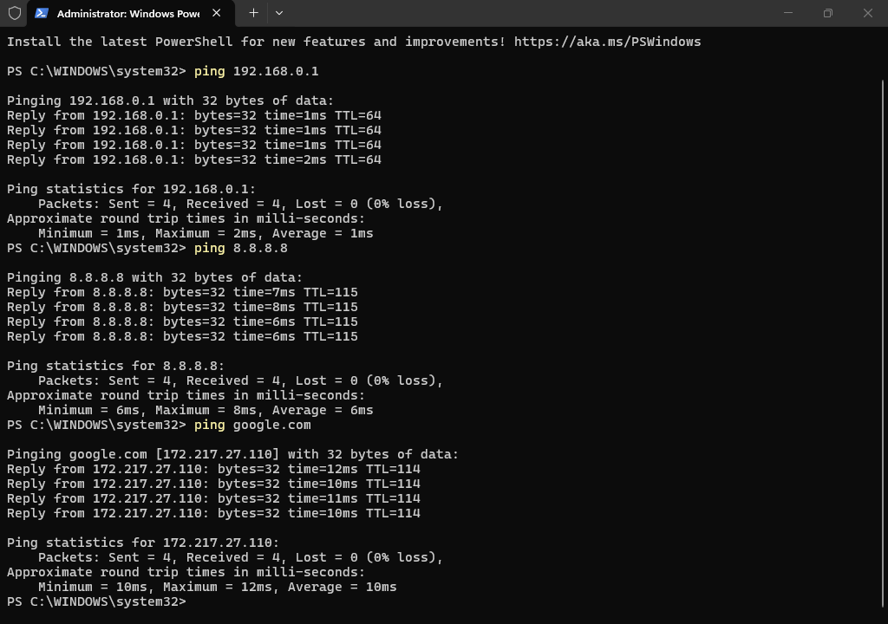
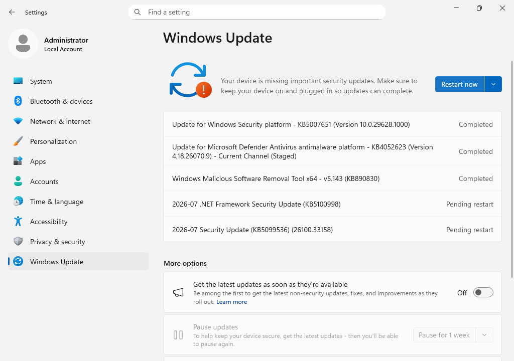

# Module 5 - Initial Configuration of DC01
> **Module Overview**
>
> This module covers the initial configuration of the Windows Server 2025 virtual machine after installation. The server was prepared for Active Directory Domain Services by renaming the computer, configuring a static IPv4 address, and verifying network connectivity.

# Objective
Prepare the Windows Server virtual machine for Active Directory Domain Services by performing the initial server configuration.

# Skills Demonstrated
- Windows Server administration
- PowerShell administration
- Computer renaming
- Static IPv4 configuration
- Network verification
- Windows Server configuration
- Technical documentation

# Technologies Used
| Technology | Purpose |
|------------|---------|
| Windows Server 2025 | Guest operating system |
| Windows PowerShell | Command-line administration |
| Server Manager | Windows Server management |
| TCP/IPv4 | Network configuration |

# Lab Environment
| Component | Value |
|-----------|-------|
| Host Server | HV01 |
| Virtual Machine | DC01 |
| Operating System | Windows Server 2025 Standard Evaluation (Desktop Experience) |
| IP Address | 192.168.0.10 |
| Default Gateway | 192.168.0.1 |

# Prerequisites
Before beginning this module, I completed:

- Windows Server installation on DC01
- First administrator sign-in
- Successful Internet connectivity

# Procedure
## Step 1 - Rename the Computer Using PowerShell
### Purpose
Assign a meaningful computer name that identifies the server within the lab environment.

### PowerShell Command
```powershell
Rename-Computer -NewName "DC01" -Restart
```

### Command Explanation
| Parameter | Purpose |
|-----------|---------|
| Rename-Computer | Renames the local computer. |
| -NewName "DC01" | Specifies the new computer name. |
| -Restart | Automatically restarts the server to apply the change. |

### Why I Used PowerShell
I chose to rename the server using PowerShell to gain experience with command-line administration. PowerShell provides a fast, repeatable, and commonly used method for managing Windows Server environments.



*Figure 5.1. Renaming the computer using PowerShell.*

## Step 2 - Verify the Computer Name
### Purpose
Confirm that the new computer name was successfully applied after the restart.

### Verification Command
```powershell
hostname
```

### Expected Output
```text
DC01
```

The command confirmed that the server name had been successfully changed.



*Figure 5.2. Verifying the computer name using PowerShell.*

## Step 3 - Configure a Static IPv4 Address
### Purpose

Assign a permanent IP address to the server before installing Active Directory Domain Services.

### Configuration
| Setting | Value |
|---------|-------|
| IP Address | 192.168.0.10 |
| Subnet Mask | 255.255.255.0 |
| Default Gateway | 192.168.0.1 |
| Preferred DNS Server | 192.168.0.1 *(Temporary)* |
| Alternate DNS Server | None |

### Why I Used a Static IP Address
A Domain Controller should always use a static IP address so clients can reliably locate services such as Active Directory and DNS.

At this stage, I temporarily configured the Preferred DNS Server to **192.168.0.1** because DC01 had not yet been configured as a DNS server.

This value will be updated in a later module after the DNS Server role is installed.



*Figure 5.3. Configuring the static IPv4 address.*

## Step 4 - Verify the Network Configuration
### Purpose
Confirm that the static IP configuration was applied successfully.

### Verification Commands
```powershell
ipconfig /all
```

```powershell
hostname
```

### Verification
I verified that:

- The computer name was **DC01**.
- The IPv4 address was **192.168.0.10**.
- The subnet mask was correctly configured.
- The default gateway was **192.168.0.1**.
- The preferred DNS server was **192.168.0.1**.



*Figure 5.4. Verifying the static network configuration.*

## Step 5 - Verify Network Connectivity
### Purpose
Confirm that the server could communicate with the local network and access external resources.

### Verification Commands
```powershell
ping 192.168.0.1
```

```powershell
ping 8.8.8.8
```

```powershell
ping google.com
```

### Verification
I confirmed that:

- The server could communicate with the default gateway.
- Internet connectivity was available.
- DNS name resolution was functioning correctly.



*Figure 5.5. Verifying local and Internet connectivity.*

## Step 6 - Confirm Server Readiness
### Purpose
Verify that the server is properly configured before installing Active Directory Domain Services.

### Final Verification
I confirmed that:

- Computer name successfully changed to **DC01**.
- Static IPv4 address configured successfully.
- Network connectivity verified.
- DNS name resolution functioning correctly.
- Windows Server ready for Active Directory Domain Services installation.

# PowerShell Commands Used
```powershell
Rename-Computer -NewName "DC01" -Restart

hostname

ipconfig

ipconfig /all

ping 192.168.0.1

ping 8.8.8.8

ping google.com
```

# Verification
The initial configuration was successfully completed.

The server is now ready for the installation of Active Directory Domain Services.

## Step 7 - Install Available Windows Updates
### Purpose

Ensure that the server is running the latest available security and quality updates before installing additional server roles.

### Actions Performed
1. Opened **Settings**.
2. Navigated to **Windows Update**.
3. Checked for available updates.
4. Downloaded and installed the available updates.
5. Restarted the server if required.

### Why I Updated the Server
Installing the latest updates before deploying server roles helps improve system stability, reliability, and security. It also reduces the likelihood of encountering known issues during future configuration tasks.



*Figure 5.6. Installing the latest available Windows Server updates.*

### Verification
I confirmed that:

- Available updates were installed successfully.
- The server restarted successfully (if required).
- Windows Server was fully operational after the update process.

# Problems Encountered
No issues were encountered during the initial server configuration.

# Lessons Learned
### Computer Naming
Using a meaningful computer name makes server identification easier and improves organization within the environment.

### PowerShell Administration
PowerShell provides an efficient and repeatable method for performing common administrative tasks such as renaming a computer.

### Static IP Configuration
Servers that provide infrastructure services should use a static IP address to ensure clients can reliably locate network services.

### Network Verification
After changing network settings, it is important to verify both IP configuration and network connectivity before installing server roles.

# Best Practices
- Use descriptive computer names.
- Configure a static IP address before installing infrastructure roles.
- Verify network connectivity after changing network settings.
- Verify configuration changes using PowerShell commands.
- Document configuration values for future troubleshooting.

# Real-World Relevance
Initial server configuration is a standard practice before deploying infrastructure services such as Active Directory Domain Services. Assigning a meaningful computer name, configuring a static IP address, and verifying connectivity help ensure a stable foundation for future server roles.

# Summary
In this module, I completed the initial configuration of the Windows Server virtual machine by renaming the server to **DC01**, configuring a static IPv4 address, verifying the network configuration, and confirming Internet connectivity. The server is now prepared for the installation of Active Directory Domain Services.

# Next Module
**Module 6 - Install Active Directory Domain Services**

The next module will focus on installing the Active Directory Domain Services role on DC01 in preparation for promoting the server to the first Domain Controller in the home lab.