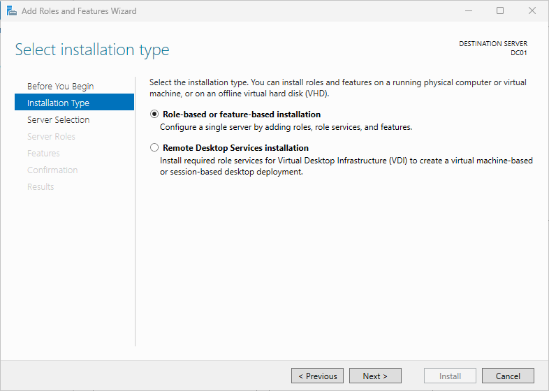
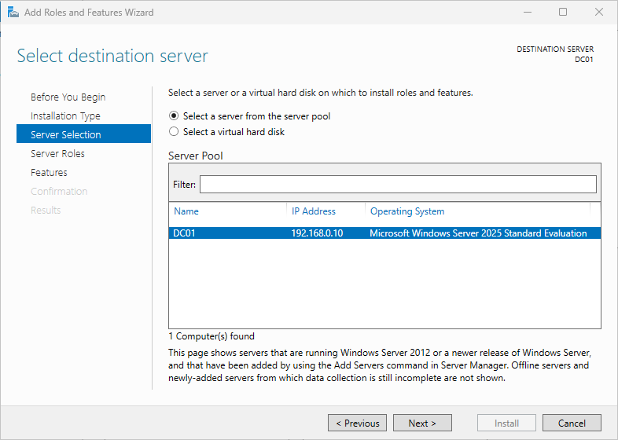
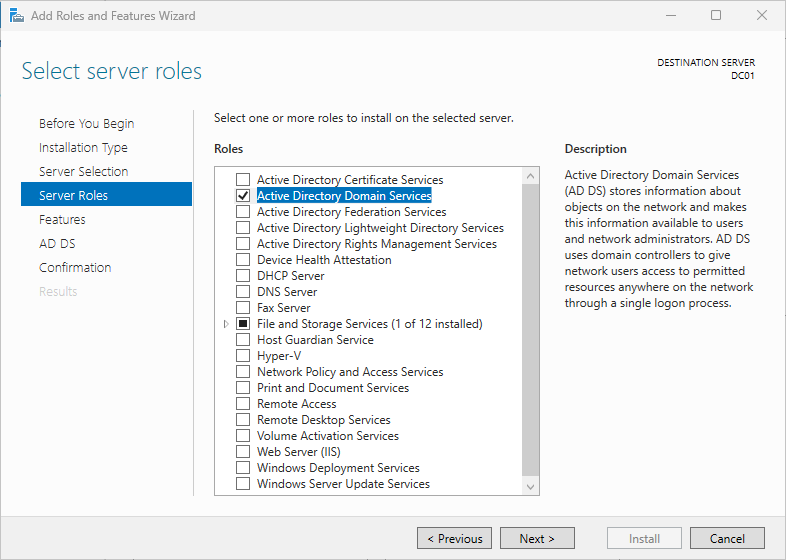
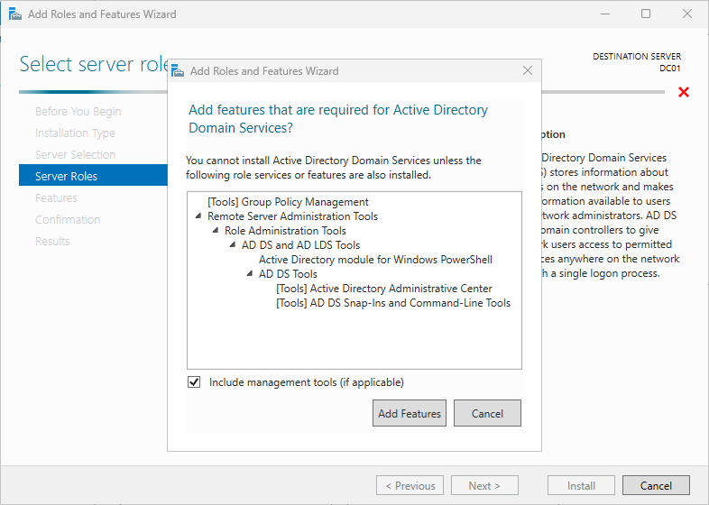
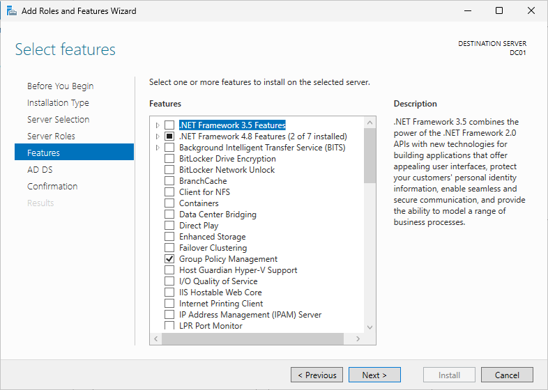
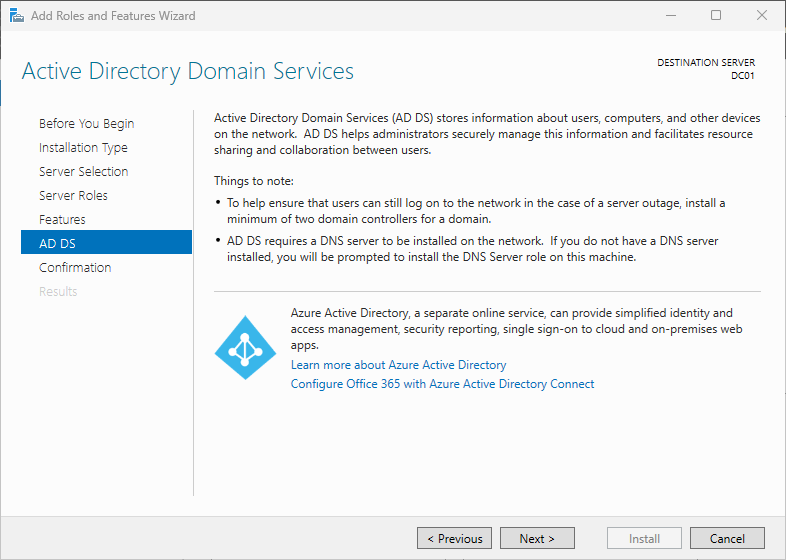
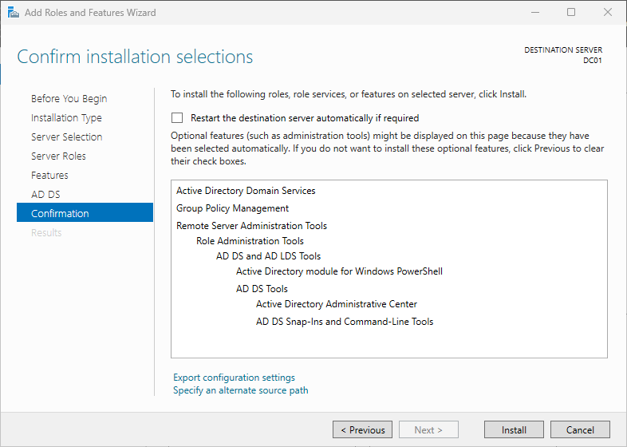
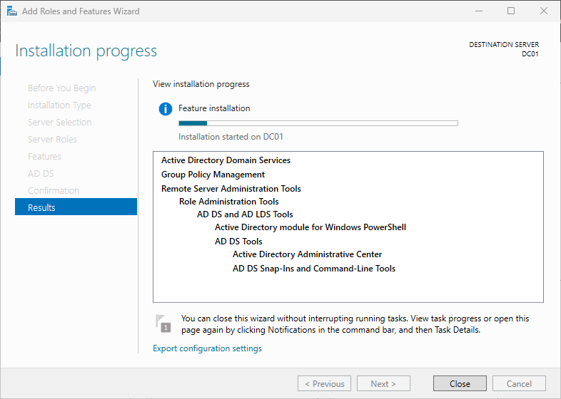
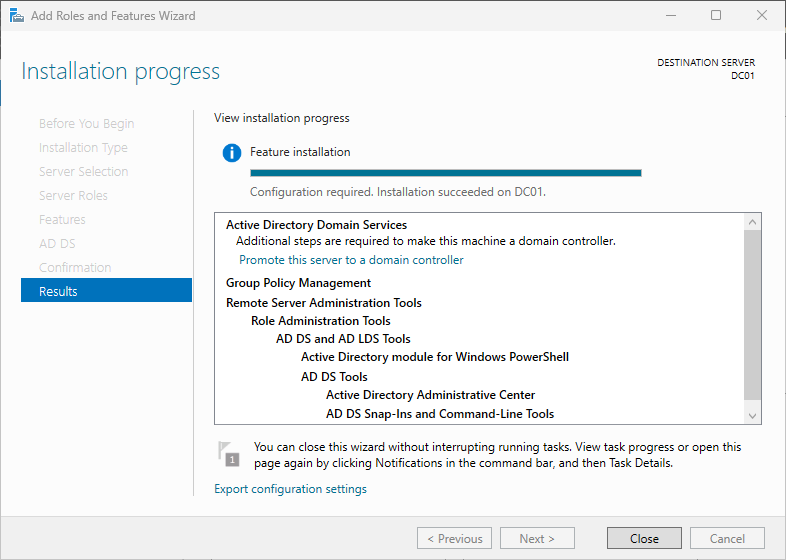

# Module 6 - Install Active Directory Domain Services
> **Module Overview**
>
> This module covers the installation of the **Active Directory Domain Services (AD DS)** server role on **DC01**. After the installation completed successfully, the server became ready for promotion to the first Domain Controller in the home lab.

# Objective
Install the Active Directory Domain Services server role on DC01 and verify that the installation completed successfully.

# Skills Demonstrated
- Windows Server role installation
- Server Manager administration
- Active Directory Domain Services deployment
- Windows Server feature management
- Role dependency management
- Technical documentation

# Technologies Used
| Technology | Purpose |
|------------|---------|
| Windows Server 2025 | Server operating system |
| Server Manager | Windows Server management |
| Active Directory Domain Services | Directory service role |
| Microsoft Management Console (MMC) | Administrative tools |

# Lab Environment
| Component | Value |
|-----------|-------|
| Host Server | HV01 |
| Virtual Machine | DC01 |
| Operating System | Windows Server 2025 Standard Evaluation (Desktop Experience) |
| Computer Name | DC01 |
| IP Address | 192.168.0.10 |

# Prerequisites
Before beginning this module, I completed:

- Windows Server installation
- Initial server configuration
- Computer rename
- Static IP configuration
- Network connectivity verification

# Procedure
## Step 1 - Open the Add Roles and Features Wizard
### Purpose
Launch the Windows Server wizard used to install server roles and features.

### Actions Performed
1. Opened **Server Manager**.
2. Selected **Manage**.
3. Clicked **Add Roles and Features**.

*Figure 6.1. Opening the Add Roles and Features Wizard.*

## Step 2 - Select the Installation Type
### Purpose
Specify the type of installation to perform.

### Configuration
| Setting | Value | Reason |
|---------|-------|--------|
| Installation Type | Role-based or feature-based installation | Used to install Windows Server roles on the selected server. |

### Why I Chose This Option
I selected **Role-based or feature-based installation** because I was installing the Active Directory Domain Services role on the local Windows Server.

*Figure 6.2. Selecting the installation type.*

## Step 3 - Select the Destination Server
### Purpose
Choose the server that will receive the Active Directory Domain Services role.

### Configuration
| Setting | Value | Reason |
|---------|-------|--------|
| Destination Server | DC01 | This server will become the first Domain Controller in the home lab. |

### Why I Chose DC01
I selected **DC01** because it is the Windows Server virtual machine prepared in the previous modules and is intended to host Active Directory Domain Services.

*Figure 6.3. Selecting the destination server.*

## Step 4 - Select the Active Directory Domain Services Role
### Purpose
Install the Active Directory Domain Services server role.

### Configuration
| Setting | Value | Reason |
|---------|-------|--------|
| Server Role | Active Directory Domain Services | Required to deploy an Active Directory domain. |

### Additional Features
When I selected **Active Directory Domain Services**, Windows Server prompted me to install the required management tools and supporting features.

I accepted the default selection by clicking **Add Features**.

No additional server roles were selected manually.

*Figure 6.4. Selecting the Active Directory Domain Services role.*

*Figure 6.5. Adding the required management tools.*

## Step 5 - Confirm Feature Selection
### Purpose
Review the additional Windows features required for Active Directory Domain Services.

### Actions Performed
I accepted the default feature selection because the required management tools had already been selected automatically.

No manual changes were required.

*Figure 6.6. Reviewing the default feature selection.*

## Step 6 - Review the Active Directory Domain Services Information
### Purpose
Review Microsoft's information about Active Directory Domain Services before installation.

After reviewing the information page, I continued with the installation.

*Figure 6.7. Reviewing the Active Directory Domain Services information.*

## Step 7 - Confirm the Installation
### Purpose
Review all installation selections before installing the server role.

### Configuration Summary
| Setting | Value |
|---------|-------|
| Installation Type | Role-based or feature-based installation |
| Destination Server | DC01 |
| Server Role | Active Directory Domain Services |
| Additional Features | Automatically installed |
| Automatic Restart | Disabled |

### Why I Left Automatic Restart Disabled
The installation of the Active Directory Domain Services role does not require an automatic restart.

Keeping this option disabled allows the administrator to control when the server restarts.

*Figure 6.8. Reviewing the installation summary.*

## Step 8 - Install Active Directory Domain Services
### Purpose
Install the Active Directory Domain Services server role.

Windows Server completed the installation by:

- Installing the Active Directory Domain Services role.
- Installing the required management tools.
- Configuring the server components.

*Figure 6.9. Installing Active Directory Domain Services.*

## Step 9 - Verify the Installation
### Purpose
Confirm that the Active Directory Domain Services role installed successfully.

### Verification
I confirmed that:

- The installation completed successfully.
- No installation errors were reported.
- Server Manager displayed the notification:

> **Promote this server to a domain controller**

This confirmed that the server was ready for Active Directory configuration.

I intentionally stopped at this point because promoting the server to a Domain Controller will be covered in the next module.

*Figure 6.10. Active Directory Domain Services installed successfully.*

*Figure 6.11. Server ready for promotion to a Domain Controller.*

# Verification
The Active Directory Domain Services role was installed successfully.

The server is now ready to be promoted to the first Domain Controller.

# Problems Encountered
No issues were encountered during the installation of the Active Directory Domain Services role.

# Lessons Learned
### Server Roles
Windows Server roles provide the functionality required to deliver infrastructure services.

### Active Directory Domain Services
Installing the Active Directory Domain Services role does not immediately create a domain. A separate promotion process is required before the server becomes a Domain Controller.

### Required Features
Windows Server automatically identifies and installs the management tools and supporting features required by Active Directory Domain Services.

# Best Practices
- Install only the required server roles.
- Review role dependencies before installation.
- Verify successful installation before continuing with configuration.
- Separate role installation from server promotion for easier troubleshooting and documentation.

# Real-World Relevance
Installing the Active Directory Domain Services role is the first stage of deploying an Active Directory infrastructure. In enterprise environments, administrators typically install the role first, verify a successful installation, and then perform the server promotion as a separate configuration task.

# Summary
In this module, I successfully installed the Active Directory Domain Services role on **DC01**. The installation completed successfully, the required management tools were installed automatically, and the server is now ready to be promoted to the first Domain Controller in the home lab.

# Next Module
**Module 7 - Promote DC01 to a Domain Controller**

The next module will configure the Active Directory forest, create the first domain, configure DNS during the promotion process, and complete the promotion of DC01 to the first Domain Controller.