# Module 7 - Promote DC01 to a Domain Controller
> **Module Overview**
>
> This module covers the promotion of **DC01** to the first Domain Controller in a new Active Directory forest. During the promotion process, Active Directory Domain Services was configured, a new Active Directory forest and domain were created, DNS was integrated, and the server became the first Domain Controller for the home lab.

# Objective
Promote DC01 to the first Domain Controller by creating a new Active Directory forest and configuring the initial Active Directory domain.

# Skills Demonstrated
- Active Directory deployment
- Domain Controller promotion
- Active Directory forest creation
- DNS integration
- Active Directory validation
- Windows Server administration
- Technical documentation

# Technologies Used
| Technology | Purpose |
|------------|---------|
| Windows Server 2025 | Server operating system |
| Active Directory Domain Services | Directory service |
| DNS Server | Name resolution for Active Directory |
| Server Manager | Windows Server administration |
| PowerShell | Verification |

# Lab Environment
| Component | Value |
|-----------|-------|
| Host Server | HV01 |
| Domain Controller | DC01 |
| Active Directory Domain | kennethlab.test |
| NetBIOS Name | KENNETHLAB |

# Prerequisites
Before beginning this module, I completed:

- Windows Server installation
- Initial server configuration
- Static IP configuration
- Active Directory Domain Services role installation

# Procedure
## Step 1 - Launch the Domain Controller Promotion Wizard
### Purpose
Begin the Active Directory Domain Services configuration process.

### Actions Performed
1. Opened **Server Manager**.
2. Selected the notification flag.
3. Clicked **Promote this server to a domain controller**.

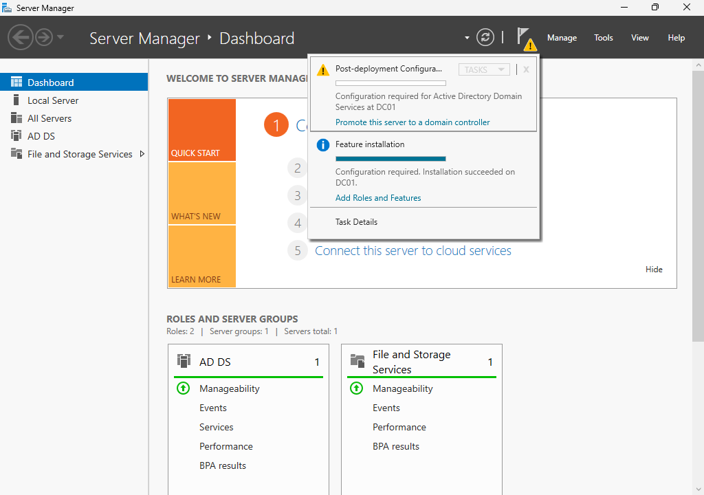

*Figure 7.1. Launching the Active Directory Domain Services Configuration Wizard.*

## Step 2 - Configure the Deployment
### Purpose
Create a new Active Directory forest.

### Configuration
| Setting | Value |
|---------|-------|
| Deployment Operation | Add a new forest |
| Root Domain Name | kennethlab.test |

### Why I Chose a New Forest
Since this was the first Domain Controller in my home lab, there was no existing Active Directory forest or domain available.

I selected **Add a new forest** to create a completely new Active Directory environment.

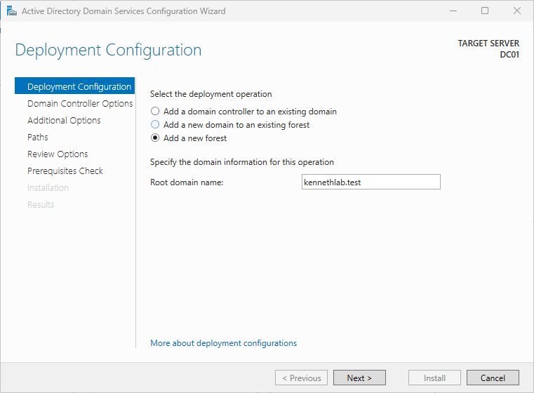

*Figure 7.2. Creating a new Active Directory forest.*

## Step 3 - Configure Domain Controller Options
### Purpose
Configure the core Active Directory settings for the new forest.

### Configuration
| Setting | Value |
|---------|-------|
| Forest Functional Level | Highest available |
| Domain Functional Level | Highest available |
| DNS Server | Enabled |
| Global Catalog | Enabled |
| Read-only Domain Controller | Disabled |
| DSRM Password | Configured |

### Why I Chose These Settings
Since this lab uses only Windows Server 2025, I selected the highest available forest and domain functional levels to enable the latest Active Directory features.

I enabled **DNS Server** because Active Directory depends on DNS for locating domain services.

The **Global Catalog** remained enabled because the first Domain Controller in a forest must also function as a Global Catalog server.

The **Read-only Domain Controller (RODC)** option remained disabled because the first Domain Controller must be writable.

I configured a **Directory Services Restore Mode (DSRM)** password, which is used for recovery and maintenance operations.

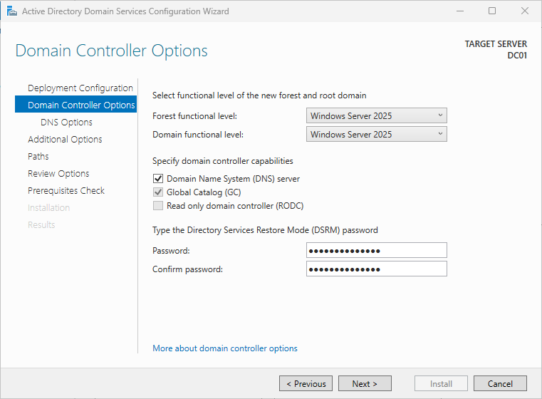

*Figure 7.3. Configuring Domain Controller options.*

## Step 4 - Configure DNS Delegation
### Purpose
Review DNS delegation settings.

### Configuration
| Setting | Value |
|---------|-------|
| Create DNS Delegation | Not Selected |

### Why I Left DNS Delegation Unchecked
This lab creates a brand-new Active Directory forest.

Since there was no existing parent DNS zone, creating a DNS delegation was unnecessary.

This is the expected configuration for the first Domain Controller in a new forest.

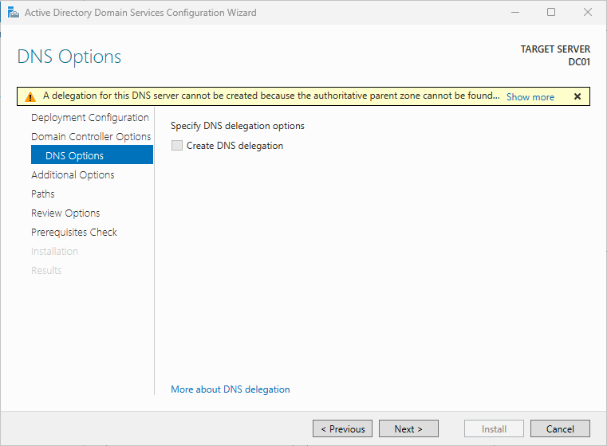

*Figure 7.4. DNS delegation options.*

## Step 5 - Configure Additional Options
### Purpose
Confirm the NetBIOS domain name.

### Configuration
| Setting | Value |
|---------|-------|
| NetBIOS Name | KENNETHLAB |

Windows automatically generated the NetBIOS name from the Active Directory domain name.

I accepted the default value because it provides a consistent short name for the domain.

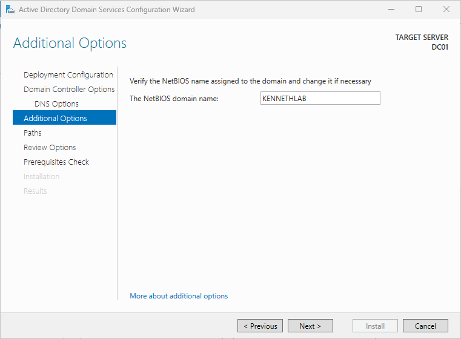

*Figure 7.5. Configuring the NetBIOS domain name.*

## Step 6 - Configure Active Directory Paths
### Purpose
Specify where Active Directory stores its database, log files, and SYSVOL folder.

### Configuration
| Component | Location |
|-----------|----------|
| Database | Default |
| Log Files | Default |
| SYSVOL | Default |

### Why I Used the Default Paths
For this home lab, the default locations provide a simple and supported configuration.

Separating the database and log files onto different storage volumes is generally considered in larger production environments, but it was unnecessary for this single-server lab.

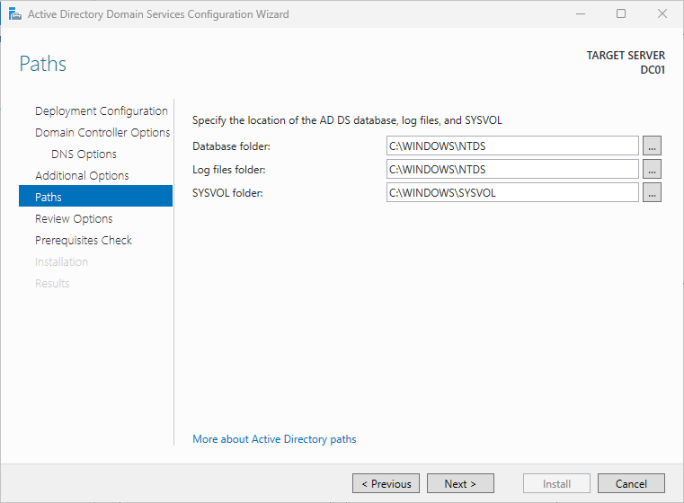

*Figure 7.6. Active Directory database and SYSVOL paths.*

## Step 7 - Review the Configuration
### Purpose
Verify the promotion settings before installation.

I reviewed all configuration settings before continuing.

I also noted that Windows Server provides a **View Script** option, which generates an equivalent PowerShell script for automated deployments.

For this lab, I completed the promotion using the graphical interface to better understand each configuration step.

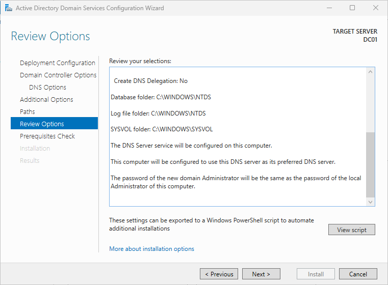

*Figure 7.7. Reviewing the Domain Controller configuration.*

## Step 8 - Complete the Prerequisite Check
### Purpose
Verify that the server met all requirements before promotion.

### Result
All prerequisite checks passed successfully.

A DNS delegation warning appeared during validation.

This warning was expected because the lab creates a new Active Directory forest with no existing parent DNS zone.

The warning did not prevent the promotion.

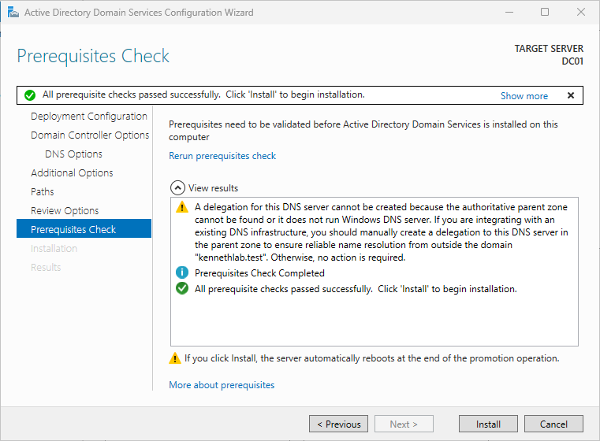

*Figure 7.8. Prerequisite validation completed successfully.*

## Step 9 - Promote the Server
### Purpose

Install and configure Active Directory.

Windows Server completed the following tasks:

- Created the Active Directory forest.
- Created the Active Directory domain.
- Installed and configured DNS.
- Configured SYSVOL.
- Promoted DC01 to the first Domain Controller.
- Restarted the server automatically.

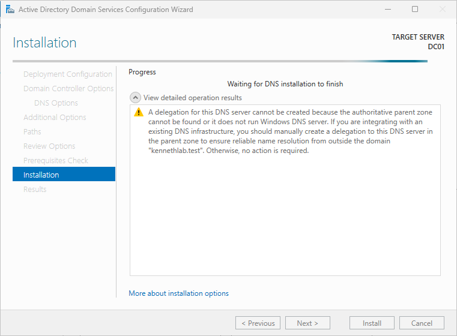

*Figure 7.9. Promoting DC01 to a Domain Controller.*

## Step 10 - Verify the Domain Controller
### Purpose
Confirm that the Domain Controller promotion completed successfully.

### Verification
I verified that:

- The server restarted successfully.
- Server Manager opened normally.
- Active Directory Users and Computers opened successfully.
- DNS Manager opened successfully.
- The domain **kennethlab.test** existed.
- PowerShell confirmed the Active Directory configuration.

### PowerShell Verification
```powershell
hostname

whoami

echo %USERDOMAIN%

Get-ADDomain
```

These commands confirmed that DC01 was successfully promoted to the first Domain Controller of the **kennethlab.test** domain.

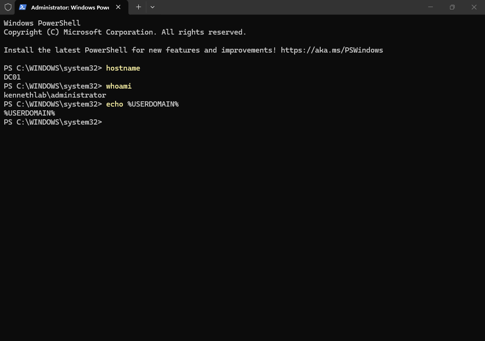

*Figure 7.10. Active Directory Users and Computers after successful promotion.*

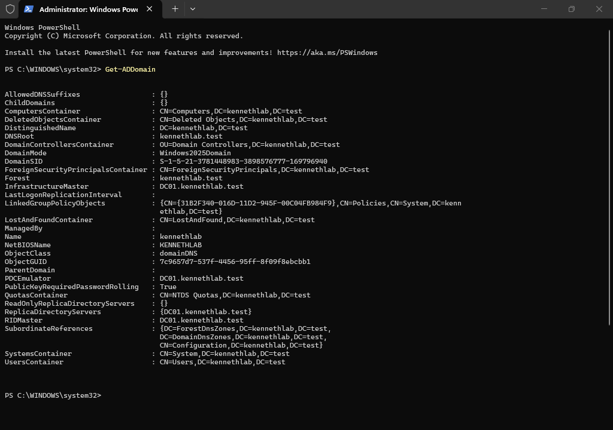

*Figure 7.11. DNS Manager after successful promotion.*

# PowerShell Commands Used
```powershell
hostname

whoami

echo %USERDOMAIN%

Get-ADDomain
```

# Verification
The Domain Controller promotion completed successfully.

I verified that:

- Active Directory was operational.
- DNS was installed and configured.
- The **kennethlab.test** domain was created successfully.
- DC01 became the first Domain Controller.
- Active Directory management tools opened successfully.

# Problems Encountered
### DNS Delegation Warning
During the prerequisite check, Windows displayed a DNS delegation warning.

This warning was expected because the lab created a new Active Directory forest with no existing parent DNS zone.

Since all prerequisite checks passed successfully, the warning did not prevent the Domain Controller promotion.

# Lessons Learned
### Active Directory Forest
The first Domain Controller creates both the Active Directory forest and the first domain.

### DNS Integration
DNS is a required component of Active Directory and is automatically configured during the promotion of the first Domain Controller.

### Global Catalog
The first Domain Controller automatically functions as a Global Catalog server.

### Verification
Successful promotion should always be verified using both graphical management tools and PowerShell commands.

# Best Practices
- Use a meaningful Active Directory domain name.
- Review every configuration page before promoting the server.
- Verify prerequisite checks before installation.
- Validate the deployment using both Server Manager and PowerShell.
- Document any warnings and understand why they occur.

# Real-World Relevance
Promoting a Windows Server to a Domain Controller is one of the most important tasks in Active Directory administration. This process establishes the foundation for centralized authentication, authorization, Group Policy, DNS integration, and user management across an enterprise network.

# Summary
In this module, I successfully promoted **DC01** to the first Domain Controller in the **kennethlab.test** Active Directory forest. The promotion configured Active Directory, integrated DNS, created the first domain, and established the core identity infrastructure for the Windows Server home lab.

# Next Module
**Module 8 - Configure Domain Name System (DNS)**

The next module will focus on exploring the DNS role installed during the Domain Controller promotion, verifying DNS zones, creating a Reverse Lookup Zone, and testing name resolution.