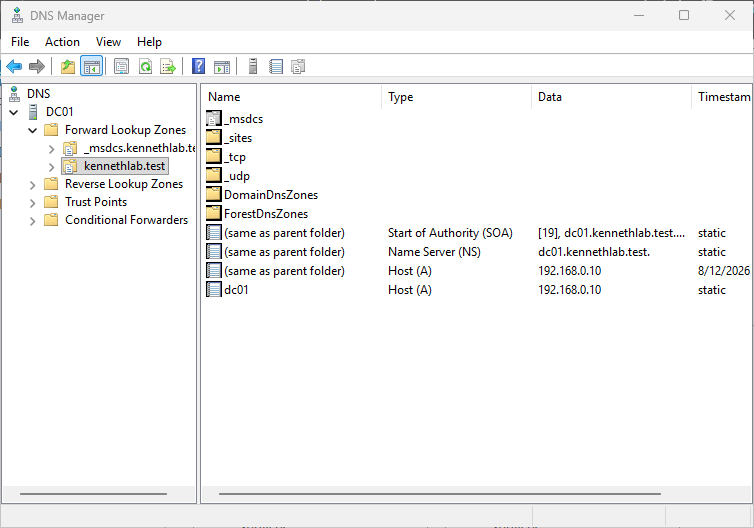
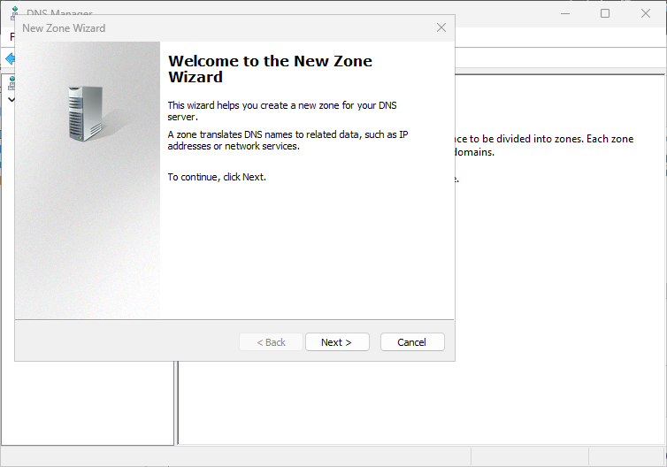
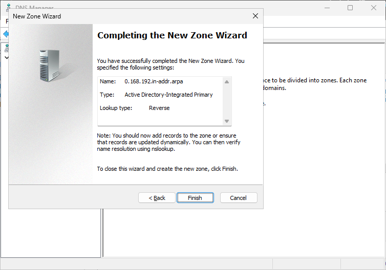
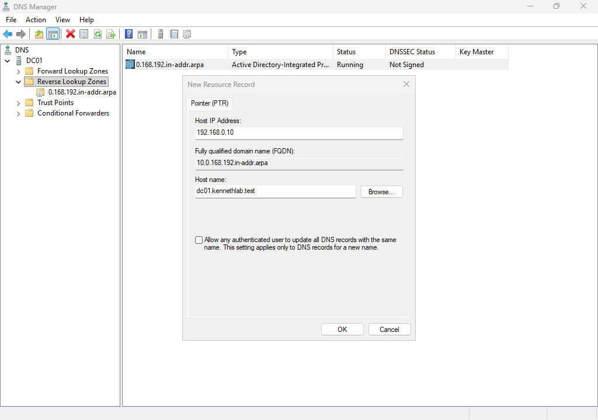
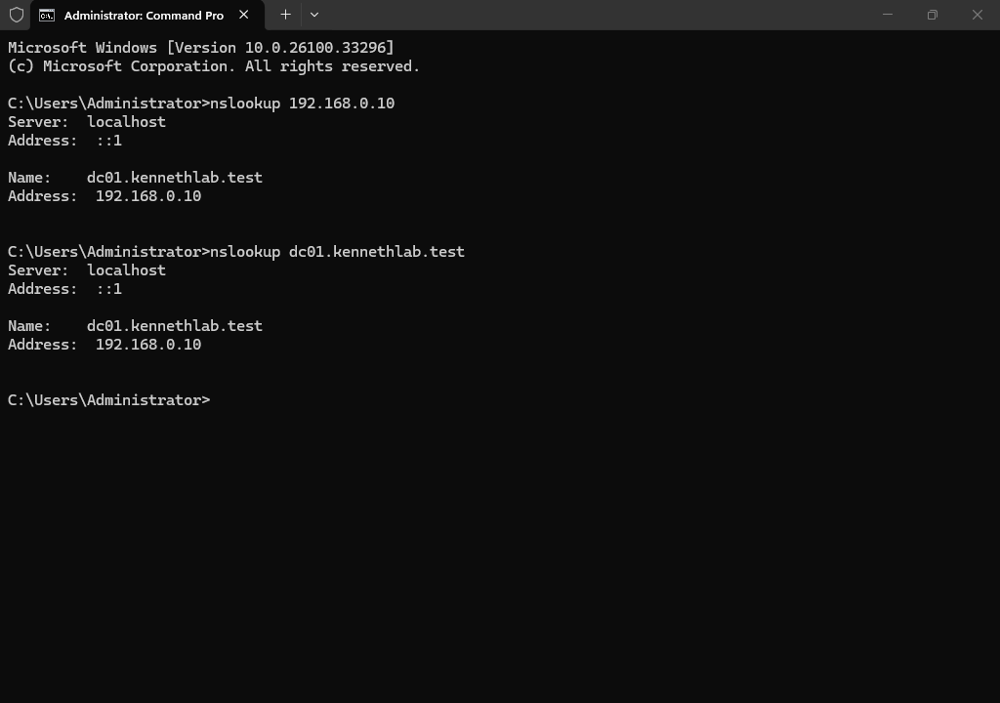

# Module 8 - Configure Domain Name System (DNS)
> **Module Overview**
>
> This module covers the verification and initial configuration of the Domain Name System (DNS) service that was installed automatically during the Active Directory Domain Services promotion. I explored the DNS Manager console, verified the Forward Lookup Zone, created a Reverse Lookup Zone, manually created a Pointer (PTR) record, and validated both forward and reverse DNS name resolution.

# Objective
Verify the DNS infrastructure installed with Active Directory and configure reverse DNS resolution for the home lab.

# Skills Demonstrated
- DNS administration
- Windows Server DNS Manager
- Forward Lookup Zones
- Reverse Lookup Zones
- DNS resource records
- Forward and reverse name resolution
- DNS verification
- Technical documentation

# Technologies Used
| Technology | Purpose |
|------------|---------|
| Windows Server 2025 | Server operating system |
| DNS Server | Name resolution service |
| DNS Manager | DNS administration |
| PowerShell / Command Prompt | DNS verification |
| Active Directory | DNS-integrated directory service |


# Lab Environment
| Component | Value |
|-----------|-------|
| Domain Controller | DC01 |
| Domain | kennethlab.test |
| IP Address | 192.168.0.10 |
| Network | 192.168.0.0/24 |

# Prerequisites
Before beginning this module, I completed:

- Domain Controller promotion
- Active Directory deployment
- DNS Server installation
- Domain verification

# Procedure
## Step 1 - Open DNS Manager
### Purpose
Verify that the DNS Server role was installed successfully during the Domain Controller promotion.

### Actions Performed
1. Opened **Server Manager**.
2. Selected **Tools**.
3. Opened **DNS Manager**.

I confirmed that the DNS console opened successfully.


*Figure 8.1. Opening DNS Manager.*

## Step 2 - Verify the Forward Lookup Zone
### Purpose
Confirm that Active Directory automatically created the DNS zone during Domain Controller promotion.

### Verification
I expanded:

```
Forward Lookup Zones
```

and confirmed that the following zone already existed:

```
kennethlab.test
```

I also verified the automatically created DNS records.

### Records Found
| Record | Purpose |
|---------|---------|
| SOA | Identifies the primary DNS server for the zone. |
| NS | Identifies the authoritative DNS server. |
| Host (A) | Maps the hostname to its IPv4 address. |

These records were automatically created during the Active Directory promotion.



*Figure 8.2. Forward Lookup Zone for the Active Directory domain.*

## Step 3 - Understand the Forward Lookup Zone
### Purpose
Understand how DNS resolves hostnames.

A Forward Lookup Zone translates:

```
Hostname → IP Address
```

Example:

```
dc01.kennethlab.test
        ↓
192.168.0.10
```

This allows computers to locate network resources using hostnames instead of remembering IP addresses.

## Step 4 - Create a Reverse Lookup Zone
### Purpose
Configure reverse DNS resolution.

### Configuration
| Setting | Value |
|---------|-------|
| Zone Type | Primary Zone |
| Store the zone in Active Directory | Enabled |
| Replication Scope | All DNS servers running on domain controllers in this domain |
| Reverse Lookup Zone Type | IPv4 |
| Network ID | 192.168.0 |
| Dynamic Updates | Allow only secure dynamic updates |

### Why I Chose These Settings
Since this DNS zone is integrated with Active Directory, I stored the zone in Active Directory and enabled secure dynamic updates to allow authenticated domain computers to update their DNS records automatically.

The Network ID **192.168.0** represents the **192.168.0.0/24** subnet.

Windows created the reverse lookup zone as:

```
0.168.192.in-addr.arpa
```

This is expected because reverse lookup zones use the **in-addr.arpa** namespace, which stores IPv4 network octets in reverse order.



*Figure 8.3. Creating the Reverse Lookup Zone.*

## Step 5 - Verify the Reverse Lookup Zone
### Purpose
Confirm that the Reverse Lookup Zone was created successfully.

### Verification
Immediately after creating the zone, I observed that only the following records existed:

- SOA
- NS

No Pointer (PTR) records existed yet.

This is expected because creating a Reverse Lookup Zone does not automatically generate PTR records for existing host records.



*Figure 8.4. Newly created Reverse Lookup Zone.*

## Step 6 - Create a Pointer (PTR) Record
### Purpose
Enable reverse DNS resolution for DC01.

### Configuration
| Setting | Value |
|---------|-------|
| Host IP Number | 10 |
| Host Name | DC01.kennethlab.test |

### Why I Used Browse
Instead of typing the hostname manually, I used the **Browse** button to select **DC01**.

This reduces typing errors and ensures that the fully qualified domain name is correct.


*Figure 8.5. Creating the PTR record.*

## Step 7 - Verify the PTR Record
### Purpose
Confirm that reverse DNS records were successfully created.

### Verification
After creating the PTR record, I verified that:

- SOA record existed.
- NS record existed.
- PTR record for **192.168.0.10** existed.



*Figure 8.6. Reverse Lookup Zone after creating the PTR record.*

## Step 8 - Verify DNS Name Resolution
### Purpose
Verify both forward and reverse DNS resolution.

### Commands Used
```cmd
nslookup dc01.kennethlab.test
```

```cmd
nslookup 192.168.0.10
```

### Verification
The commands successfully resolved:

- Hostname → IP Address
- IP Address → Hostname

This confirmed that both Forward Lookup and Reverse Lookup were functioning correctly.



*Figure 8.7. Verifying DNS name resolution.*

# Commands Used
```cmd
nslookup dc01.kennethlab.test

nslookup 192.168.0.10
```

# Verification
I confirmed that:

- DNS Manager opened successfully.
- The Forward Lookup Zone existed.
- The Reverse Lookup Zone was created successfully.
- A PTR record was created for DC01.
- Forward DNS resolution worked correctly.
- Reverse DNS resolution worked correctly.

# Problems Encountered
### Reverse Lookup Zone Initially Contained Only SOA and NS Records
After creating the Reverse Lookup Zone, I noticed that only the SOA and NS records existed.

Initially, I expected the PTR record for DC01 to appear automatically.

I learned that creating a Reverse Lookup Zone does **not** automatically create PTR records for existing Host (A) records.

I manually created the PTR record, which successfully enabled reverse DNS resolution.

# Key DNS Concepts Learned
| Concept | Description |
|---------|-------------|
| Forward Lookup Zone | Resolves hostnames to IP addresses. |
| Reverse Lookup Zone | Resolves IP addresses to hostnames. |
| SOA Record | Identifies the primary DNS server for the zone. |
| NS Record | Identifies the authoritative DNS server. |
| Host (A) Record | Maps a hostname to an IPv4 address. |
| PTR Record | Maps an IPv4 address back to a hostname. |

# Lessons Learned
### Forward and Reverse DNS
DNS works in two directions.

Forward Lookup resolves:

```
Hostname → IP Address
```

Reverse Lookup resolves:

```
IP Address → Hostname
```

### Reverse Lookup Zone
Creating a Reverse Lookup Zone creates only the DNS container.

PTR records must exist before reverse lookups can succeed.

### PTR Records
PTR records enable reverse DNS resolution and may need to be created manually if the Reverse Lookup Zone is created after Host (A) records already exist.

# Best Practices
- Verify DNS immediately after Domain Controller promotion.
- Use Active Directory-integrated DNS zones.
- Enable secure dynamic updates.
- Verify both forward and reverse DNS resolution.
- Understand automatically created DNS records before creating custom records.

# Real-World Relevance
DNS is one of the most critical services in an Active Directory environment. Active Directory relies on DNS to locate Domain Controllers and network services. Understanding Forward Lookup Zones, Reverse Lookup Zones, and DNS resource records is an essential skill for Windows Server administrators.

# Summary
In this module, I verified the DNS service installed during Domain Controller promotion, explored the automatically created DNS records, created a Reverse Lookup Zone, manually created a PTR record for DC01, and successfully verified both forward and reverse DNS resolution. These steps completed the initial DNS configuration for the Windows Server home lab.

# Next Module
**Module 9 - Join Windows 11 Client to the Domain**

The next module will configure a Windows 11 client to communicate with the Domain Controller and join the **kennethlab.test** Active Directory domain.