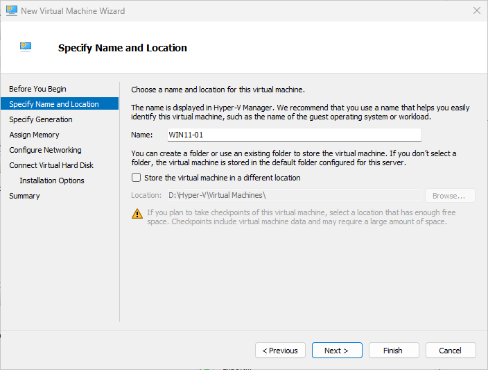
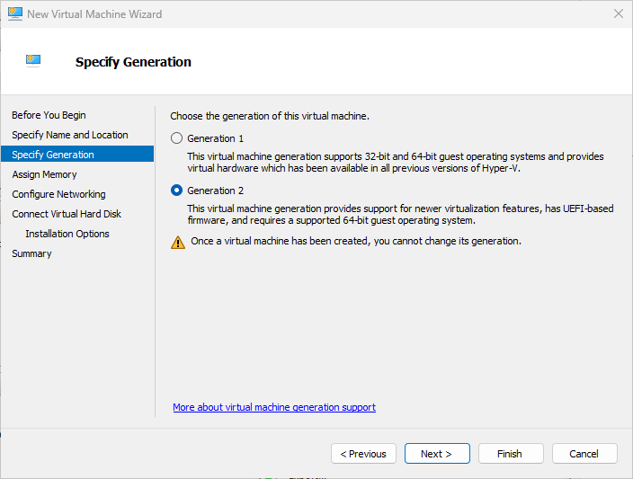
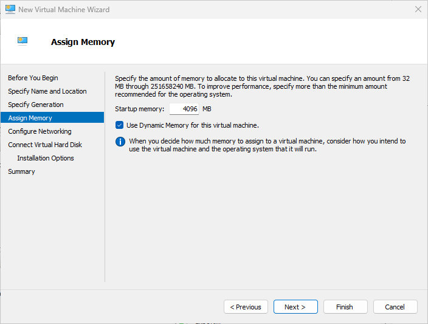
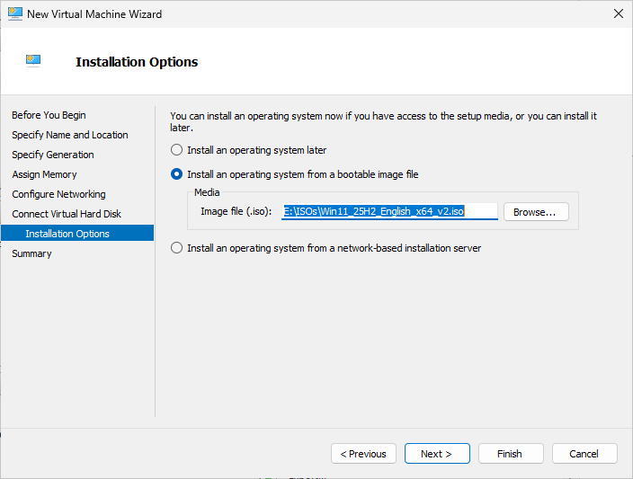
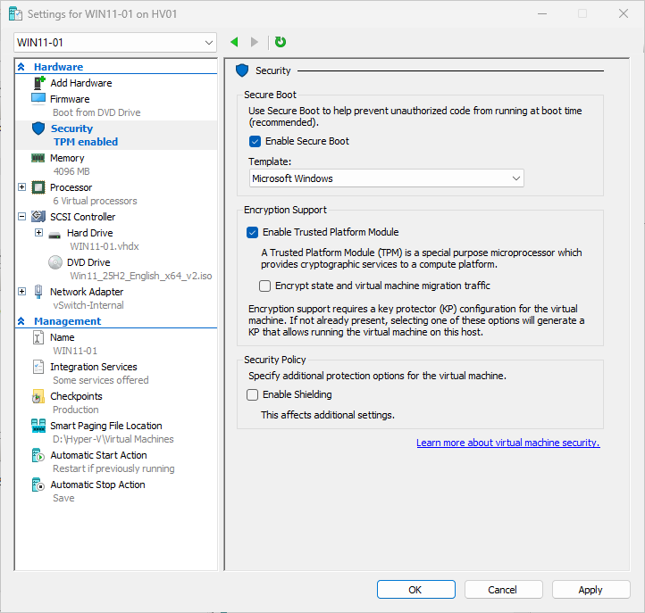

# Module 9 - Create Windows 11 Client Virtual Machine
> **Module Overview**
>
> This module covers the creation and configuration of the Windows 11 client virtual machine (WIN11-01) using Hyper-V. The virtual machine was prepared with the appropriate virtual hardware, storage, networking, and security settings required to support Windows 11 and future Active Directory integration.

# Objective
Create a Windows 11 virtual machine that will serve as the client computer for the Windows Server home lab.

# Skills Demonstrated
- Hyper-V virtual machine creation
- Windows client virtualization
- Virtual hardware configuration
- Hyper-V networking
- Virtual storage configuration
- Windows 11 hardware requirements
- Technical documentation

# Technologies Used
| Technology | Purpose |
|------------|---------|
| Hyper-V | Virtualization platform |
| Windows 11 ISO | Operating system installation media |
| Generation 2 Virtual Machine | Modern virtual hardware platform |
| Secure Boot | Windows 11 security requirement |
| Trusted Platform Module (TPM) | Windows 11 security requirement |

# Lab Environment
| Component | Value |
|-----------|-------|
| Virtual Machine | WIN11-01 |
| Generation | Generation 2 |
| Startup Memory | 4096 MB |
| Dynamic Memory | Enabled |
| Processor | 2 Virtual Processors |
| Virtual Hard Disk | 80 GB VHDX |
| Virtual Switch | External vSwitch |
| Installation Media | Windows 11 ISO |

# Prerequisites
Before beginning this module, I completed:

- Hyper-V installation
- Hyper-V default storage configuration
- Virtual switch configuration
- Domain Controller deployment
- DNS configuration

# Procedure
## Step 1 - Create a New Virtual Machine

Opened Hyper-V Manager and selected:

```
New
→ Virtual Machine
```

Assigned the virtual machine name:

```
WIN11-01
```

Used the default Hyper-V storage location configured in Module 2.



*Figure 9.1. Creating the Windows 11 virtual machine.*

## Step 2 - Select Virtual Machine Generation
Selected:

```
Generation 2
```

### Why Generation 2?
Generation 2 provides:

- UEFI firmware
- Secure Boot support
- TPM compatibility
- Modern virtual hardware required by Windows 11

Since the virtual machine generation cannot be changed after creation, selecting the correct generation during setup is important.



*Figure 9.2. Selecting Generation 2.*

## Step 3 - Configure Memory
Configured:

| Setting | Value |
|---------|-------|
| Startup Memory | 4096 MB |
| Dynamic Memory | Enabled |

Dynamic Memory allows Hyper-V to allocate memory efficiently based on the virtual machine workload.



*Figure 9.3. Configuring memory.*

## Step 4 - Configure Networking
Connected the virtual machine to the:

```
External vSwitch
```

Using the External virtual switch allows the client virtual machine to communicate with the physical network and access the Internet during Windows installation.


*Figure 9.4. Configuring networking.*

## Step 5 - Configure Virtual Hard Disk
Created a new virtual hard disk using:

| Setting | Value |
|---------|-------|
| Size | 80 GB |
| Type | VHDX |
| Location | Hyper-V default storage location |

The 80 GB virtual disk provides sufficient capacity for Windows 11, updates, and future Active Directory lab exercises.


*Figure 9.5. Creating the virtual hard disk.*

## Step 6 - Attach Installation Media
Configured the installation source:

```
Install an operating system from a bootable image file
```

Selected the Windows 11 ISO.



*Figure 9.6. Attaching the Windows 11 ISO.*

## Step 7 - Complete the Virtual Machine Creation
Reviewed the virtual machine summary and completed the wizard.

Verified that WIN11-01 appeared successfully in Hyper-V Manager.


*Figure 9.7. Virtual machine configuration summary.*

## Step 8 - Verify Virtual Hardware
Verified the following Hyper-V settings:

- Secure Boot enabled
- Trusted Platform Module (TPM) enabled
- 2 virtual processors configured
- Windows 11 ISO attached

These settings satisfy the hardware requirements for Windows 11.



*Figure 9.8. Windows 11 virtual machine security settings.*

# Verification
I confirmed that:

- WIN11-01 was created successfully.
- Generation 2 was selected.
- Dynamic Memory was enabled.
- Secure Boot was enabled.
- TPM was enabled.
- The Windows 11 ISO was attached.
- The virtual machine was ready for Windows installation.

# Lessons Learned
- Windows 11 requires Generation 2 virtual machines.
- Secure Boot and TPM are required for Windows 11 installation.
- Dynamic Memory improves Hyper-V resource utilization.
- Using a consistent naming convention makes virtual machines easier to manage.

# Best Practices
- Use Generation 2 for modern operating systems.
- Enable Secure Boot and TPM before installation.
- Allocate sufficient memory and storage for future updates.
- Follow a consistent virtual machine naming convention.
# Summary

In this module, I successfully created the WIN11-01 virtual machine using Hyper-V. I configured Generation 2, Secure Boot, TPM, Dynamic Memory, 2 virtual processors, an 80 GB virtual hard disk, and attached the Windows 11 installation media. The virtual machine is now prepared for Windows 11 installation.

# Next Module

**Module 10 – Install Windows 11 on WIN11-01**