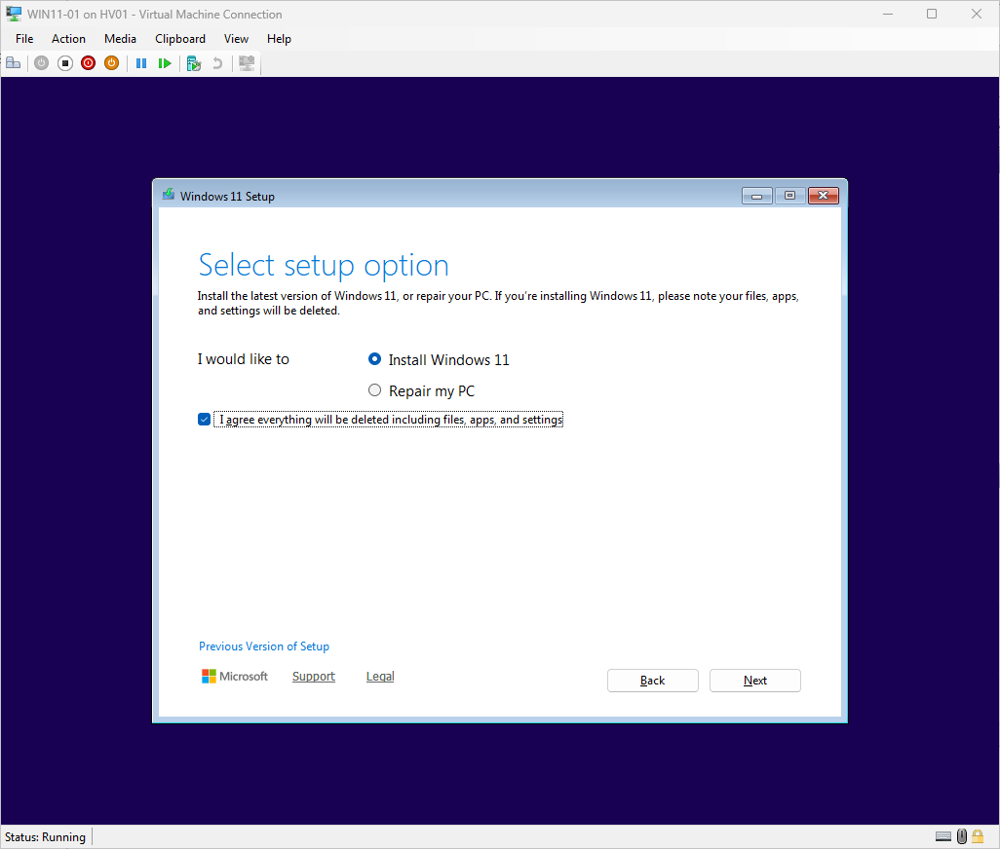
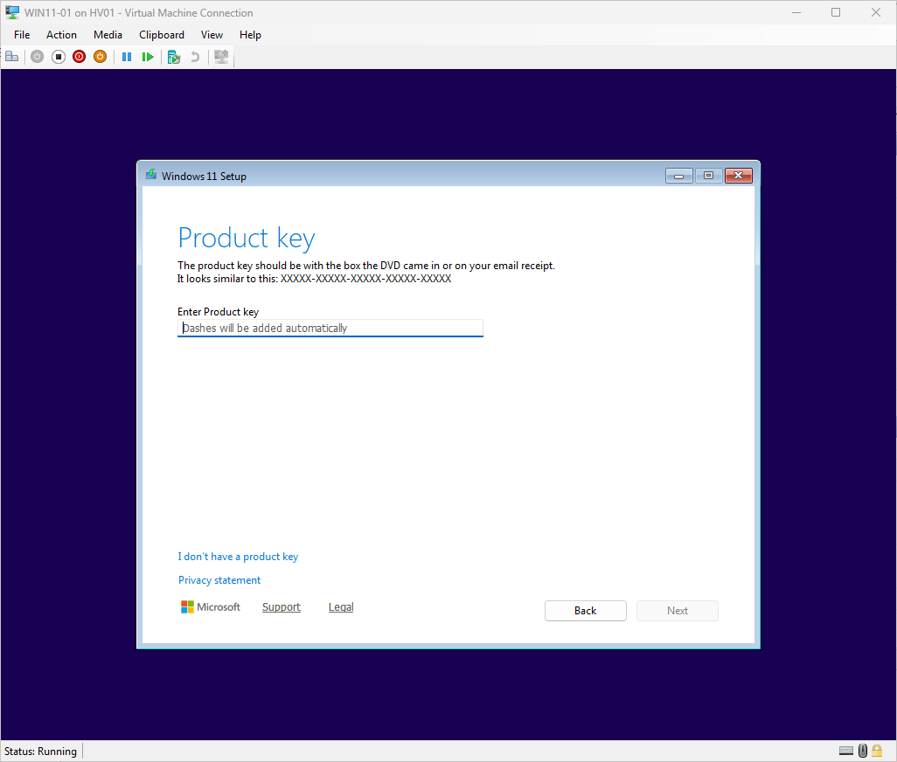
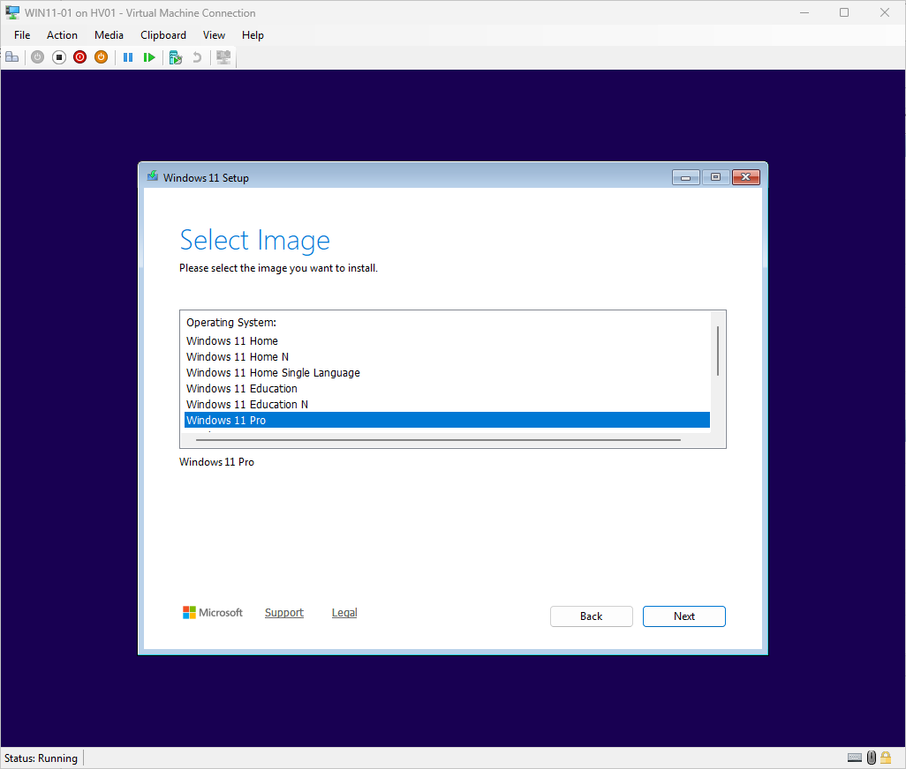
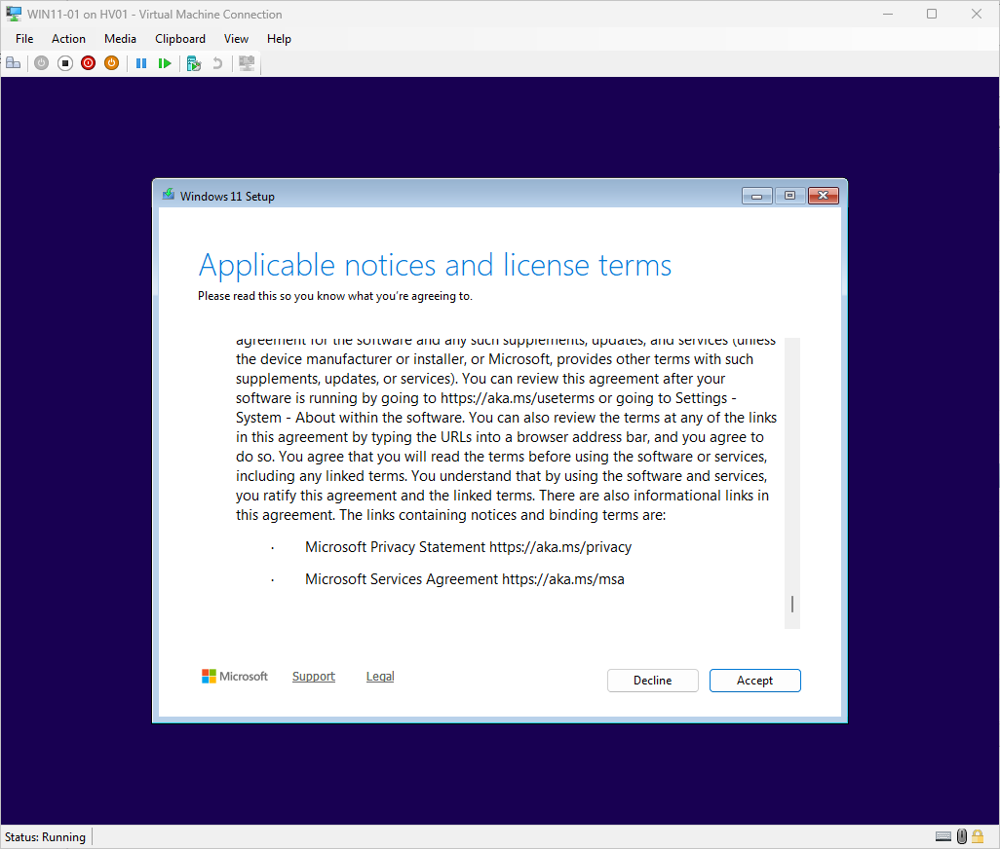
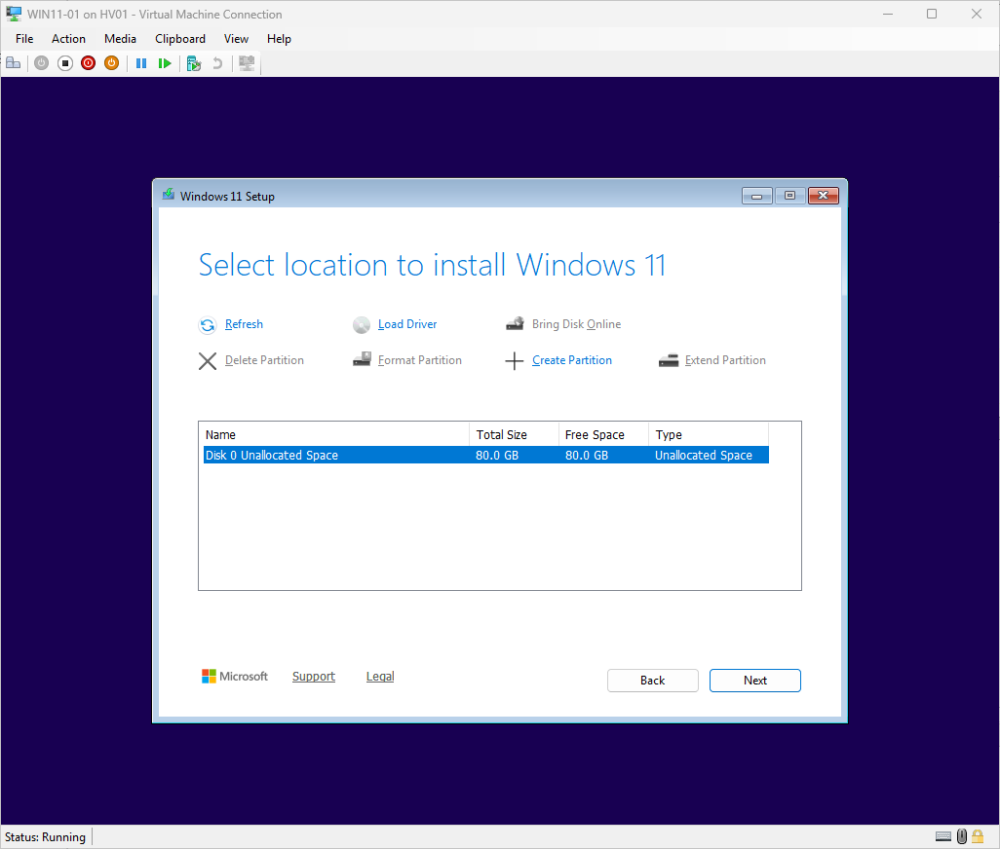
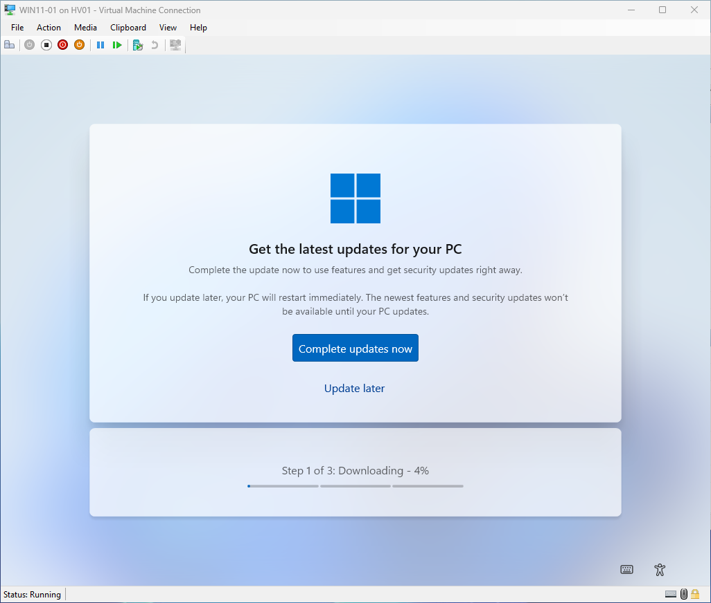
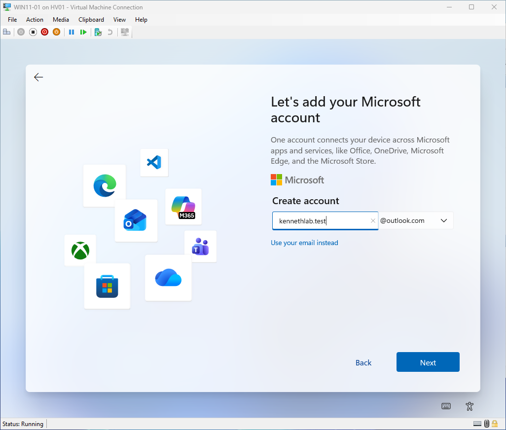
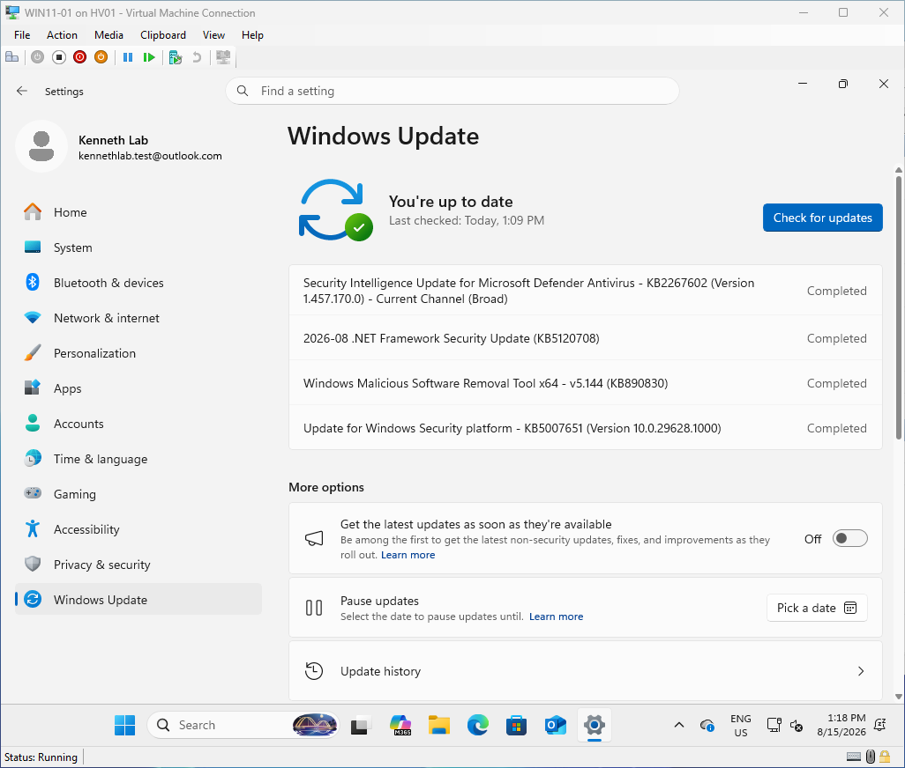
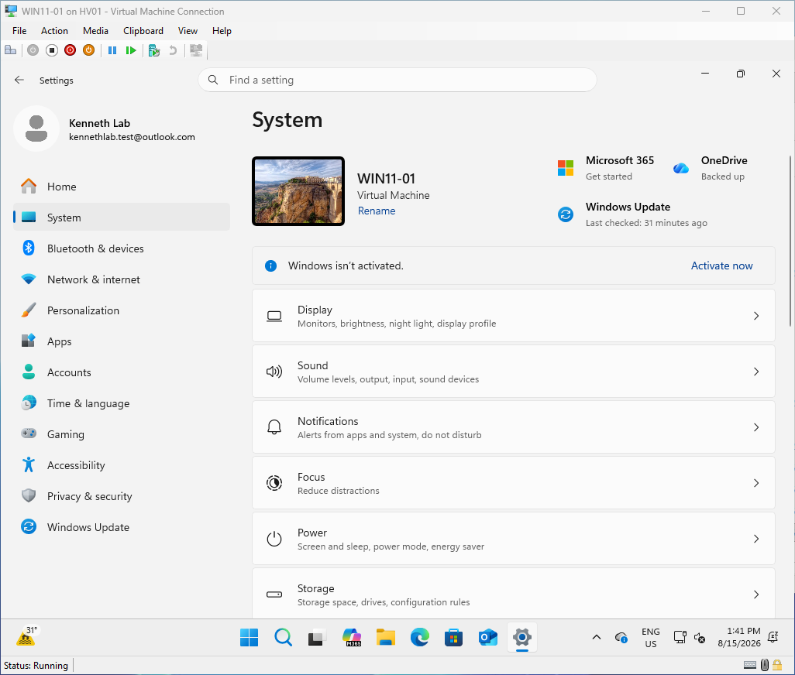

# Module 10 - Install Windows 11 on WIN11-01
> **Module Overview**
>
> This module covers the installation of Windows 11 Pro on the WIN11-01 virtual machine. The process includes Windows Setup, Out-of-Box Experience (OOBE), initial operating system configuration, Windows Update, and verification that the client is ready for Active Directory integration.

# Objective
Install Windows 11 Pro on the WIN11-01 virtual machine and prepare the operating system for domain configuration.

# Skills Demonstrated
- Windows 11 installation
- Windows Setup (OOBE)
- Operating system deployment
- Windows Update
- Initial operating system configuration
- Windows client administration
- Technical documentation

# Technologies Used
| Technology | Purpose |
|------------|---------|
| Windows 11 Pro | Client operating system |
| Hyper-V | Virtualization platform |
| Windows Update | Operating system updates |
| Microsoft Account | Temporary account used to complete Windows 11 setup |

# Lab Environment
| Component | Value |
|-----------|-------|
| Virtual Machine | WIN11-01 |
| Operating System | Windows 11 Pro |
| Hypervisor | Hyper-V |
| Network | External vSwitch |
| Installation Media | Windows 11 ISO |

# Prerequisites
Before beginning this module, I completed:

- Module 9 – Create Windows 11 Client Virtual Machine
- Attached the Windows 11 installation ISO
- Verified Secure Boot and TPM were enabled
- Verified the virtual machine hardware configuration

# Procedure
## Step 1 - Configure Windows Setup
### Purpose
Configure the initial Windows installation settings.

### Actions Performed
Configured:

- Language
- Time and currency format
- Keyboard layout

Selected:

```
Install Windows
```

to begin the installation.



*Figure 10.1. Configuring Windows Setup.*

## Step 2 - Product Key
### Purpose
Continue the installation without activating Windows.

### Actions Performed
Selected:

```
I don't have a product key
```

Windows activation can be completed later without affecting the lab.



*Figure 10.2. Continuing without entering a product key.*

## Step 3 - Select Windows Edition
### Actions Performed
Selected:

```
Windows 11 Pro
```

### Why Windows 11 Pro?
Windows 11 Pro supports:

- Active Directory domain join
- Group Policy
- Business administration features

Windows 11 Home cannot join an on-premises Active Directory domain.



*Figure 10.3. Selecting Windows 11 Pro.*

## Step 4 - Accept the License Agreement
Accepted the Microsoft Software License Terms and continued with the installation.



*Figure 10.4. Accepting the Microsoft Software License Terms.*

## Step 5 - Select Installation Drive
### Actions Performed

Selected:

```
Drive 0 Unallocated Space
```

Windows automatically created the required system partitions and began installing Windows.



*Figure 10.5. Selecting the installation drive.*

## Step 6 - Install Windows
Windows Setup completed the installation by:

- Copying Windows files
- Installing features
- Installing updates
- Completing installation

The virtual machine restarted automatically several times.



*Figure 10.6. Windows installation in progress.*

## Step 7 - Complete the Out-of-Box Experience (OOBE)
### Actions Performed
Configured:

- Region
- Keyboard layout
- Device name

Assigned the computer name:

```
WIN11-01
```

Selected:

```
Set up as a new PC
```

to create a clean Windows installation.


*Figure 10.7. Completing the Out-of-Box Experience.*

## Step 8 - Sign In with a Temporary Microsoft Account
### Purpose
Complete the Windows 11 installation.

### Actions Performed

Windows 11 (25H2) required:

- Internet connectivity
- Microsoft account authentication

I temporarily signed in using a Microsoft account to complete the installation.

This account is only used to complete Windows Setup and does not prevent the computer from joining the on-premises Active Directory domain later.



*Figure 10.8. Signing in with a temporary Microsoft account.*

## Step 9 - Configure Initial Windows Experience
### Actions Performed
During the Out-of-Box Experience, I selected:

- Set up as a new PC
- Skipped Microsoft 365 Personal
- Skipped Microsoft 365 Basic
- Declined browser history personalization
- Skipped other optional Microsoft consumer features

These options were not required for the Active Directory home lab.

## Step 10 - Update Windows
### Purpose
Install the latest Windows updates before configuring the computer for Active Directory.

### Actions Performed

Opened:

```
Settings
→ Windows Update
```

Installed all available updates.

Restarted the virtual machine when required.

Verified that Windows Update reported:

```
You're up to date
```



*Figure 10.9. Updating Windows 11.*

## Step 11 - Verify Installation
### Verification
Confirmed:

- Windows 11 Pro installed successfully.
- Computer name is WIN11-01.
- Windows Update completed successfully.
- The operating system is ready for Active Directory configuration.



*Figure 10.10. Verifying the Windows 11 installation.*

# Verification

I confirmed that:

- Windows 11 Pro installed successfully.
- WIN11-01 booted normally.
- Windows Update completed successfully.
- The operating system is fully updated.
- The client is ready for Active Directory integration.

# Problems Encountered
## Windows 11 25H2 Required Internet Connectivity and a Microsoft Account
During the Windows 11 Out-of-Box Experience (OOBE), I initially attempted to complete the installation using an Internal virtual switch without Internet access.

Windows stopped at the **"Let's connect you to a network"** screen and would not continue.

After switching the virtual machine to the External virtual switch, Windows was able to access the Internet and continue the setup.

Because Windows 11 version 25H2 required Microsoft account authentication during OOBE, I temporarily signed in using a Microsoft account to complete the installation.

# Lessons Learned
- Windows 11 Pro is required for joining an on-premises Active Directory domain.
- Recent Windows 11 versions (25H2) require Internet connectivity and Microsoft account authentication during OOBE.
- Completing Windows Update before joining the domain provides a stable and secure client operating system.
- Optional Microsoft consumer services can be skipped without affecting enterprise functionality.

# Best Practices
- Install Windows updates before joining the domain.
- Use Windows 11 Pro for Active Directory environments.
- Keep the operating system fully updated before applying Group Policy.
- Use a consistent computer naming convention across all lab systems.

# Summary
In this module, I successfully installed Windows 11 Pro on the WIN11-01 virtual machine, completed the Windows Setup and Out-of-Box Experience, temporarily used a Microsoft account to satisfy Windows 11 version 25H2 setup requirements, installed all available Windows updates, and verified that the client operating system is fully prepared for Active Directory domain integration.

# Next Module
**Module 11 – Configure Windows 11 Client and Join the Active Directory Domain**