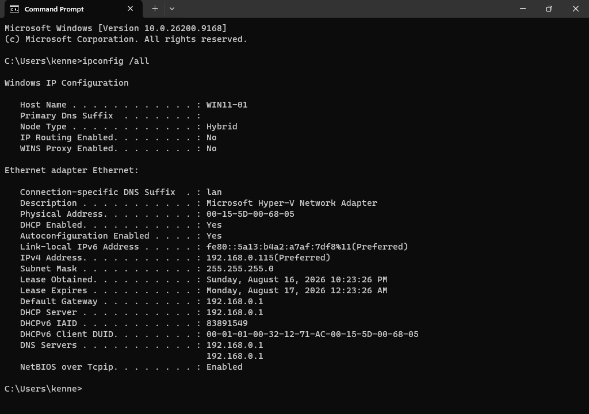
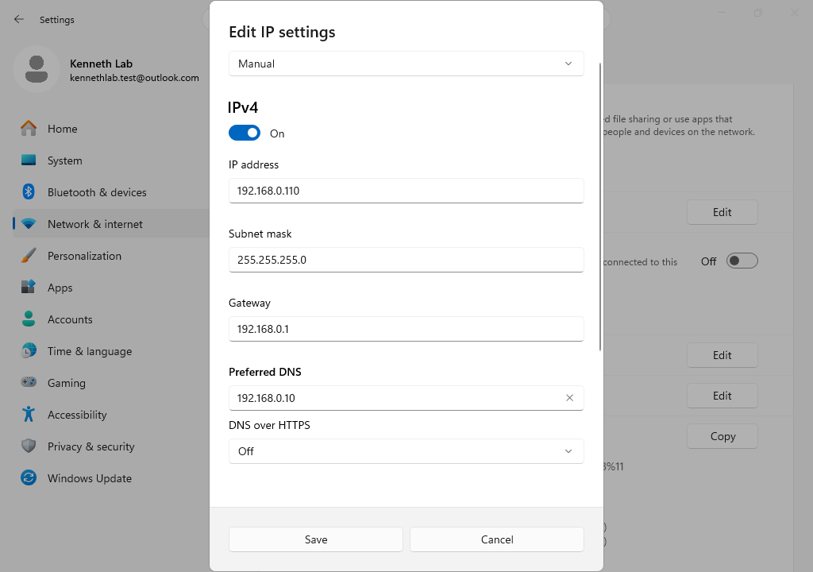
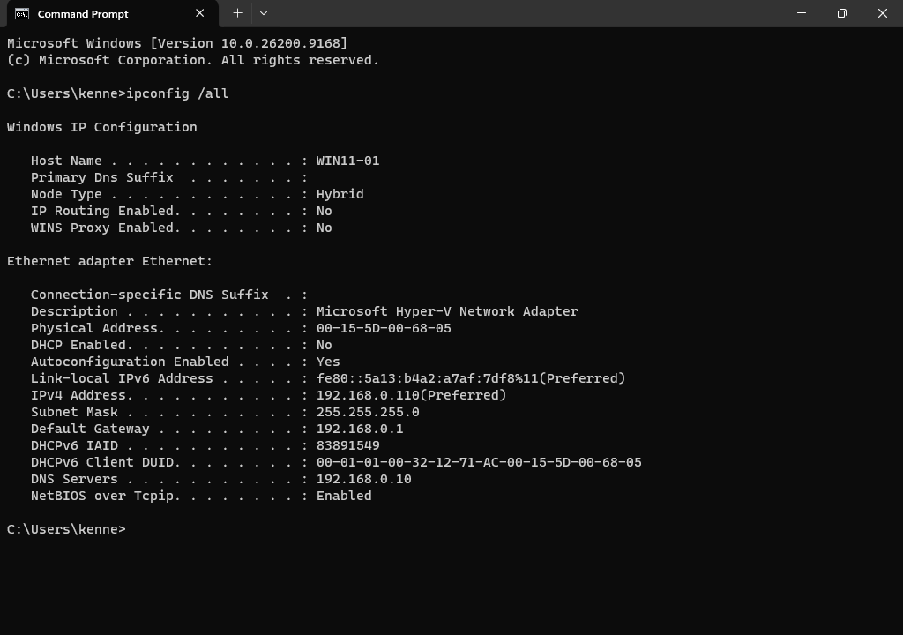
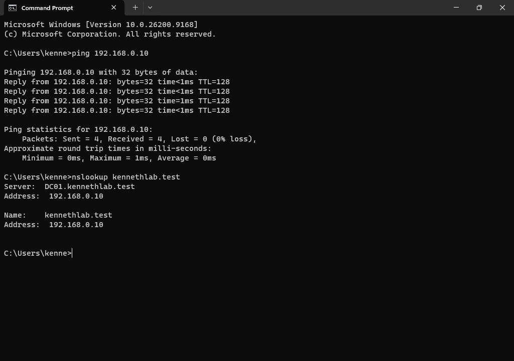
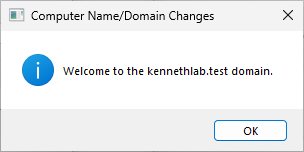
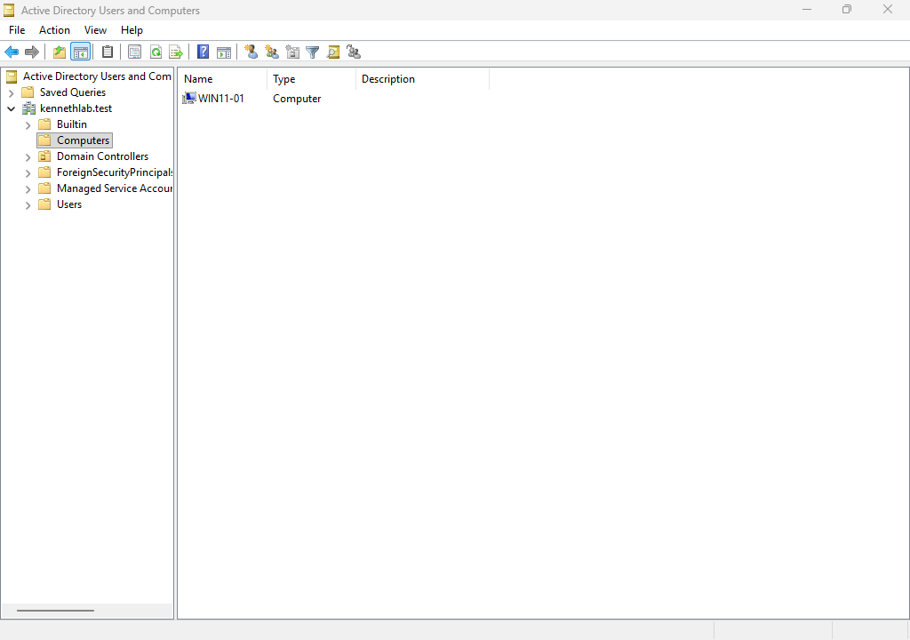

# Module 11 - Configure Windows 11 Client and Join the Active Directory Domain
> **Module Overview**
>
> This module covers the network configuration of the Windows 11 client (WIN11-01), verification of connectivity with the Domain Controller, and joining the client computer to the **kennethlab.test** Active Directory domain.

# Objective
Configure the Windows 11 client with the appropriate network settings and join it to the Active Directory domain.

# Skills Demonstrated
- Windows network configuration
- Static IPv4 configuration
- DNS configuration
- Network connectivity verification
- Active Directory domain join
- Domain authentication
- Active Directory administration
- Technical documentation

# Technologies Used
| Technology | Purpose |
|------------|---------|
| Windows 11 Pro | Client operating system |
| Active Directory Domain Services | Domain authentication |
| Domain Name System (DNS) | Name resolution |
| Hyper-V | Virtualization platform
| Command Prompt | Network verification |

# Lab Environment
| Component | Value |
|-----------|-------|
| Client Computer | WIN11-01 |
| Domain Controller | DC01 |
| Domain | kennethlab.test |
| Domain Controller IP | 192.168.0.10 |
| Client Static IP | 192.168.0.110 |
| Default Gateway | 192.168.0.1 |
| Preferred DNS Server | 192.168.0.10 |

# Prerequisites
Before beginning this module, I completed:

- Module 8 – Configure Domain Name System (DNS)
- Module 9 – Create Windows 11 Client Virtual Machine
- Module 10 – Install Windows 11 on WIN11-01
- Verified that DC01 was operational

# Procedure
## Step 1 - Verify the Current Network Configuration
### Purpose
Review the current network configuration before assigning a static IP address.

### Actions Performed
Opened Command Prompt and executed:

```cmd
ipconfig /all
```

Recorded the existing:

- IPv4 Address
- Subnet Mask
- Default Gateway
- DNS Server

This information was used to avoid IP address conflicts during manual configuration.



*Figure 11.1. Current network configuration before assigning a static IP address.*

## Step 2 - Configure a Static IPv4 Address
### Purpose
Assign a fixed IP address to the Windows 11 client.

### Actions Performed
Configured the following network settings:

| Setting | Value |
|---------|-------|
| IP Address | 192.168.0.110 |
| Subnet Mask | 255.255.255.0 |
| Default Gateway | 192.168.0.1 |
| Preferred DNS Server | 192.168.0.10 |

The Domain Controller was configured as the Preferred DNS Server to allow the client to locate Active Directory services.



*Figure 11.2. Configuring the static IPv4 address.*

## Step 3 - Verify Network Connectivity
### Purpose
Confirm communication with the Domain Controller before joining the domain.

### Actions Performed
Executed the following commands:

```cmd
ipconfig /all
```

```cmd
ping 192.168.0.10
```

```cmd
nslookup kennethlab.test
```

```cmd
nslookup dc01.kennethlab.test
```

Verified that:

- The static IP address was applied successfully.
- The client could communicate with DC01.
- DNS resolution was functioning correctly.
- The Active Directory domain could be resolved.





*Figure 11.3.1 & 11.3.2. Verifying connectivity with the Domain Controller.*

## Step 4 - Join the Active Directory Domain
### Purpose
Join WIN11-01 to the Active Directory domain.

### Actions Performed
Opened:

```
Settings
→ System
→ About
→ Domain or Workgroup
```

Selected:

```
Change...
```

Entered the domain:

```
kennethlab.test
```

Authenticated using the domain Administrator account.

Received the confirmation message:

```
Welcome to the kennethlab.test domain
```

Restarted the client computer to complete the domain join.



*Figure 11.4. Joining WIN11-01 to the Active Directory domain.*

## Step 5 - Verify Domain Membership
### Purpose
Confirm that the client successfully joined the Active Directory domain.

### Actions Performed
Signed in using the domain Administrator account.

Verified that:

- WIN11-01 successfully authenticated with the domain.
- The computer object appeared in:

```
Active Directory Users and Computers
→ Computers
```

Confirmed that WIN11-01 was successfully added to the Active Directory domain.



*Figure 11.5. WIN11-01 displayed in Active Directory Users and Computers.*

# Verification
I confirmed that:

- WIN11-01 was configured with a static IP address.
- The Preferred DNS Server was set to DC01.
- Network connectivity with DC01 was successful.
- DNS resolution functioned correctly.
- WIN11-01 successfully joined the Active Directory domain.
- The computer object appeared in Active Directory Users and Computers.
- Domain authentication was successful.

# Problems Encountered
## DNS Verification Failed While DC01 Was Powered Off
After configuring WIN11-01 to use DC01 as its Preferred DNS Server, the initial connectivity tests failed because the Domain Controller was not running.

Since the client relied on DC01 for DNS resolution, Active Directory-related name resolution could not be completed until the Domain Controller was powered on.

### Resolution
Started DC01 and repeated the connectivity tests.

After the Domain Controller became available, network connectivity and DNS resolution completed successfully, allowing the client to join the Active Directory domain.

# Lessons Learned
- Active Directory clients should use the Domain Controller as their Preferred DNS Server.
- Network connectivity and DNS resolution should always be verified before joining a domain.
- Domain Controllers must be operational before clients can authenticate or resolve Active Directory resources.
- Using a static IP address simplifies administration within a lab environment.

# Best Practices
- Verify network connectivity before joining a domain.
- Configure the Domain Controller as the Preferred DNS Server for all domain clients.
- Confirm DNS resolution before troubleshooting domain join issues.
- Use consistent IP addressing and computer naming conventions.

# Summary
In this module, I configured a static IPv4 address on WIN11-01, assigned DC01 as the Preferred DNS Server, verified network connectivity and DNS resolution, successfully joined the client to the **kennethlab.test** Active Directory domain, and confirmed that the computer object was created in Active Directory Users and Computers.

# Next Module
**Module 12 - Active Directory Users and Group Management**