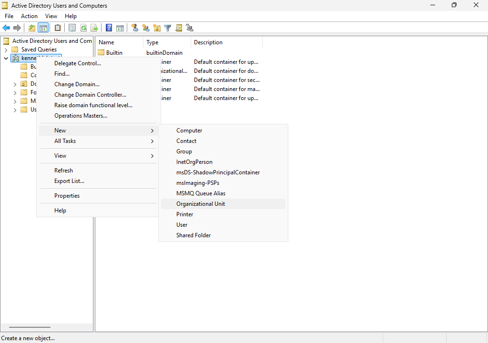
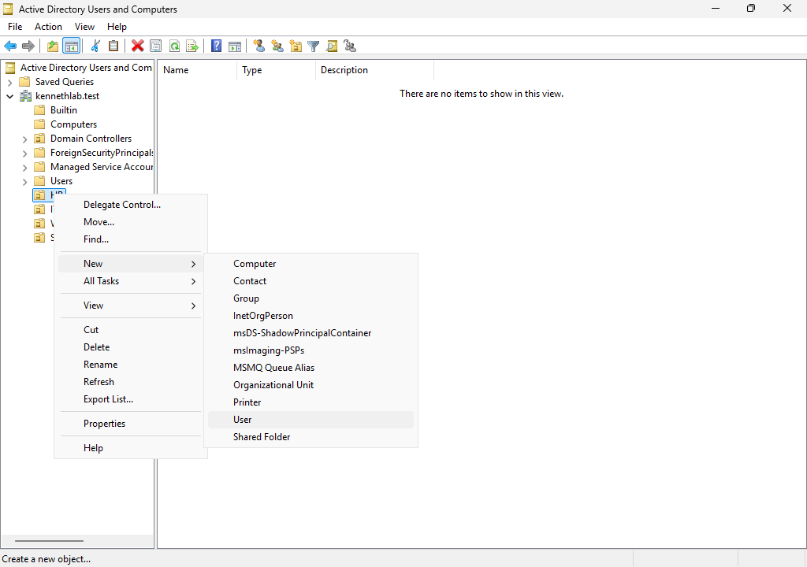
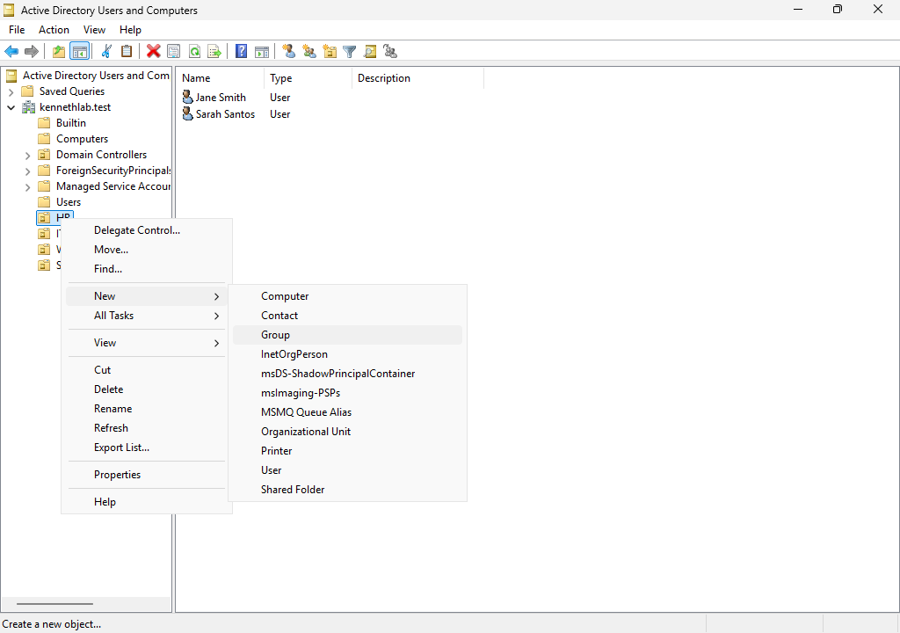
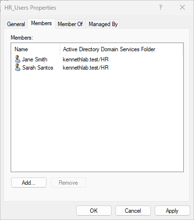
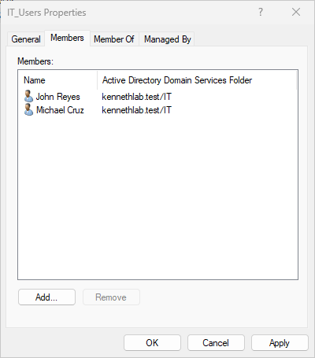
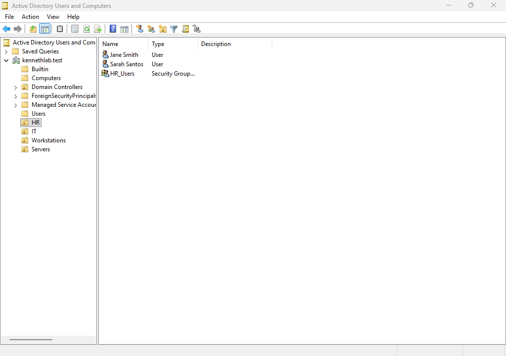
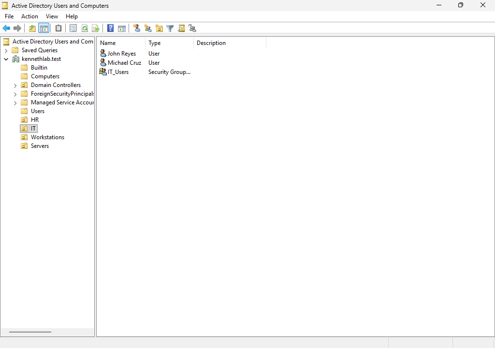

# Module 12 - Active Directory Users and Group Management
> **Module Overview**
>
> This module covers the creation and organization of Active Directory objects, including Organizational Units (OUs), user accounts, and security groups. The module also demonstrates assigning users to department-based security groups following Active Directory administration best practices.

# Objective
Create and organize Active Directory objects by implementing Organizational Units, user accounts, and security groups to prepare the domain for centralized administration and resource management.

# Skills Demonstrated
- Active Directory administration
- Organizational Unit (OU) management
- User account creation
- Security group management
- Group membership administration
- Identity management
- Technical documentation

# Technologies Used
| Technology | Purpose |
|------------|---------|
| Active Directory Domain Services | Identity and access management |
| Active Directory Users and Computers | Directory administration |
| Windows Server 2025 | Domain Controller |

# Lab Environment
| Component | Value |
|-----------|-------|
| Domain Controller | DC01 |
| Domain | kennethlab.test |
| Management Tool | Active Directory Users and Computers |

# Prerequisites
Before beginning this module, I completed:

- Module 6 – Install Active Directory Domain Services
- Module 7 – Promote DC01 to a Domain Controller
- Module 8 – Configure Domain Name System (DNS)
- Module 11 – Configure Windows 11 Client and Join the Active Directory Domain

# Procedure
## Step 1 - Create Organizational Units
### Purpose
Organize Active Directory objects into logical administrative containers.

### Actions Performed
Opened:

```
Server Manager
→ Tools
→ Active Directory Users and Computers
```

Created the following Organizational Units:

- HR
- IT
- Servers
- Workstations

Enabled:

```
Protect container from accidental deletion
```

for each Organizational Unit.



*Figure 12.1. Creating Organizational Units.*

## Step 2 - Create User Accounts
### Purpose
Create sample domain user accounts for each department.

### Actions Performed
Created the following user accounts:

| Organizational Unit | Name | User Logon Name |
|---------------------|------|-----------------|
| HR | Jane Smith | jane.smith |
| HR | Sarah Santos | sarah.santos |
| IT | John Reyes | john.reyes |
| IT | Michael Cruz | michael.cruz |

Assigned a temporary password during account creation.

Enabled:

```
User must change password at next logon
```

for each user account.



*Figure 12.2. Creating Active Directory user accounts.*

## Step 3 - Create Security Groups
### Purpose
Organize users into department-based security groups.

### Actions Performed
Created the following Global Security Groups:

| Organizational Unit | Group Name | Group Scope | Group Type |
|---------------------|------------|-------------|------------|
| HR | HR_Users | Global | Security |
| IT | IT_Users | Global | Security |



*Figure 12.3. Creating Global Security Groups.*

## Step 4 - Configure Group Membership
### Purpose
Assign users to their corresponding department groups.

### Actions Performed
Configured the following memberships:

### HR_Users
- Jane Smith
- Sarah Santos

### IT_Users
- John Reyes
- Michael Cruz

Verified that each user was successfully added to the appropriate security group.





*Figure 12.4.1 & 12.4.2. Configuring security group membership.*

## Step 5 - Verify Active Directory Structure
### Purpose
Confirm that all Organizational Units, users, and groups were created successfully.

### Actions Performed
Verified the Active Directory structure:

```
kennethlab.test
│
├── HR
│   ├── Jane Smith
│   ├── Sarah Santos
│   └── HR_Users
│
├── IT
│   ├── John Reyes
│   ├── Michael Cruz
│   └── IT_Users
│
├── Servers
│
└── Workstations
```

Verified that:

- Organizational Units were created successfully.
- User accounts were created successfully.
- Security groups were created successfully.
- Group memberships were configured correctly.





*Figure 12.5. Verifying the Active Directory structure.*

# Verification
I confirmed that:

- HR, IT, Servers, and Workstations Organizational Units were created.
- Four Active Directory user accounts were created successfully.
- Two Global Security Groups were created successfully.
- Users were assigned to the appropriate department security groups.
- The Active Directory structure matched the planned organizational design.

# Lessons Learned
- Organizational Units provide logical organization for Active Directory objects and simplify administration.
- User accounts represent individual identities that authenticate to the domain.
- Security Groups simplify permission management by assigning access to groups instead of individual users.
- Organizing users into department-based groups follows Active Directory administration best practices.

# Best Practices
- Organize Active Directory objects using Organizational Units.
- Assign permissions to Security Groups rather than directly to users.
- Use descriptive naming conventions for users and groups.
- Protect Organizational Units from accidental deletion.

# Summary
In this module, I organized the Active Directory environment by creating Organizational Units, user accounts, and department-based Global Security Groups. I assigned users to the appropriate security groups, creating a structured directory that supports centralized administration and prepares the environment for future modules involving shared folders, permissions, and Group Policy.

# Next Module
**Module 13 - Shared Folder and NTFS Permissions**