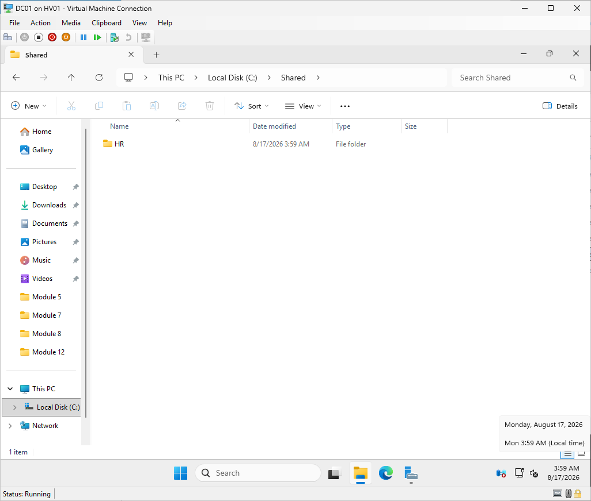
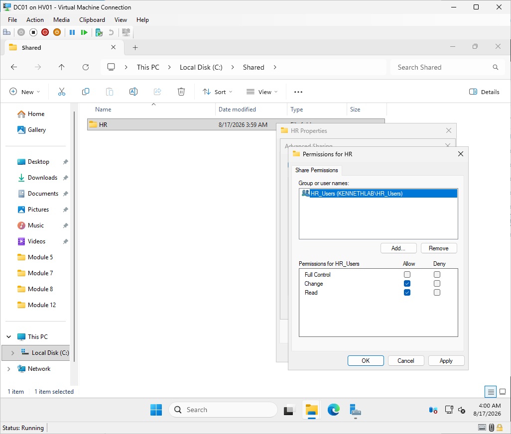
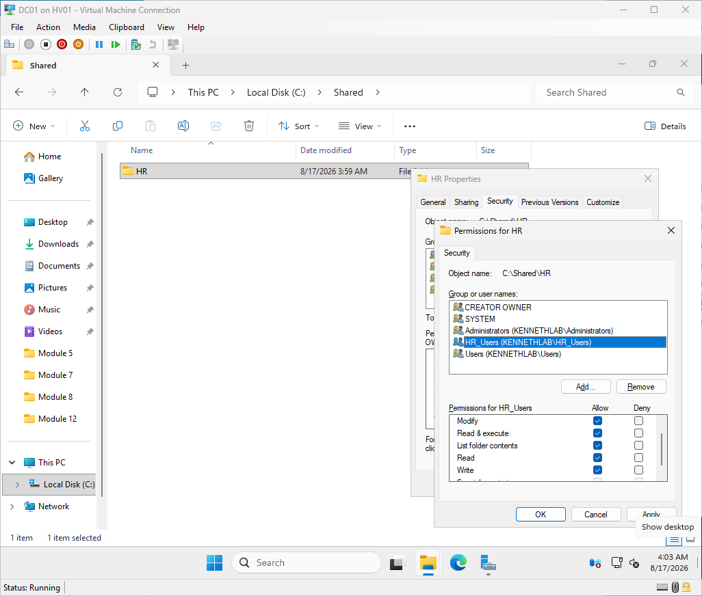
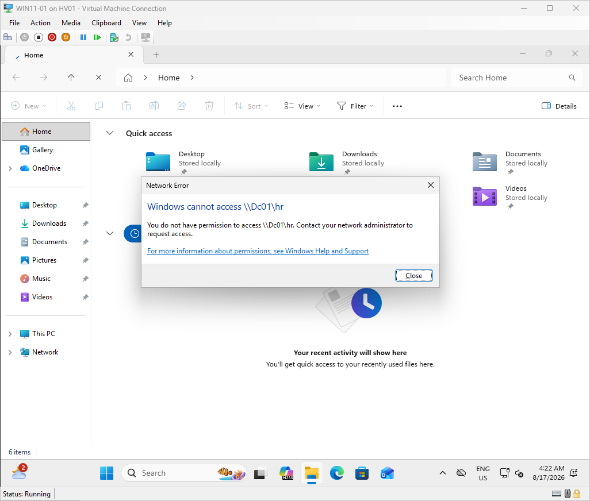

# Module 13 - Shared Folder and NTFS Permissions
> **Module Overview**
>
> This module covers the creation of a departmental shared folder, configuration of Share Permissions and NTFS Permissions, and validation of file access using Active Directory Security Groups. The module demonstrates how Windows Server uses group-based authorization to control access to shared resources.

# Objective
Create a shared folder for the Human Resources department, configure Share and NTFS permissions, and verify access using Active Directory users and security groups.

# Skills Demonstrated
- Windows File Server administration
- Shared folder configuration
- Share Permissions
- NTFS Permissions
- Security Group authorization
- Access validation
- Active Directory administration
- Technical documentation

# Technologies Used
| Technology | Purpose |
|------------|---------|
| Windows Server 2025 | File Server |
| Active Directory Domain Services | Identity and authentication |
| Active Directory Users and Computers | User and group management |
| NTFS | File system permissions |
| SMB (Server Message Block) | Network file sharing |

# Lab Environment
| Component | Value |
|-----------|-------|
| File Server | DC01 |
| Client Computer | WIN11-01 |
| Domain | kennethlab.test |
| Shared Folder | D:\Shared\HR |
| Share Name | HR |

# Prerequisites
Before beginning this module, I completed:

- Module 11 – Configure Windows 11 Client and Join the Active Directory Domain
- Module 12 – Active Directory Users and Group Management

# Procedure
## Step 1 - Create the Shared Folder
### Purpose
Create a folder that will be shared with Human Resources users.

### Actions Performed
On **DC01**, created the following folder structure:

```
D:\
└── Shared
    └── HR
```

This folder will be used to store Human Resources documents.



*Figure 13.1. Creating the HR shared folder.*

## Step 2 - Configure Share Permissions
### Purpose
Configure network sharing for the HR folder.

### Actions Performed
Opened:

```
HR Folder
→ Properties
→ Sharing
→ Advanced Sharing
```

Enabled:

```
Share this folder
```

Share Name:

```
HR
```

Configured Share Permissions:

| Group | Permission |
|--------|------------|
| HR_Users | Change, Read |

Removed the default **Everyone** group to restrict access.



*Figure 13.2. Configuring Share Permissions.*

## Step 3 - Configure NTFS Permissions
### Purpose
Configure file system permissions for authorized users.

### Actions Performed
Opened:

```
HR Folder
→ Properties
→ Security
```

Added:

```
KENNETHLAB\HR_Users
```

Assigned the following NTFS permissions:

- Modify
- Read & Execute
- List Folder Contents
- Read
- Write

Administrators and SYSTEM retained Full Control.



*Figure 13.3. Configuring NTFS permissions.*

## Step 4 - Validate User Access
### Purpose
Verify that Share and NTFS permissions work as intended.

### Actions Performed
Logged on to **WIN11-01** using different Active Directory user accounts.

Accessed the shared folder using:

```
\\DC01\HR
```

Performed the following tests.

### Positive Test
Logged in as:

```
KENNETHLAB\jane.smith
```

Successfully:

- Opened the shared folder
- Created files
- Renamed files
- Modified files
- Deleted files

### Negative Test
Logged in as:

```
KENNETHLAB\john.reyes
```

Attempted to access:

```
\\DC01\HR
```

Access was denied because the account is not a member of **HR_Users**.



*Figure 13.4. Validating user access.*

# Verification
Verified that:

- The HR shared folder was successfully created.
- The folder was shared successfully.
- Share Permissions were configured correctly.
- NTFS Permissions were configured correctly.
- HR_Users had Modify access.
- Jane Smith successfully accessed and modified files.
- John Reyes was denied access.
- Security Group authorization functioned as expected.

# Access Validation
| Test User | Department | Expected Result | Actual Result | Status |
|-----------|------------|-----------------|---------------|--------|
| Jane Smith | HR | Read and Modify access | Successfully opened the folder and created, renamed, modified, and deleted files | ✅ Passed |
| John Reyes | IT | Access denied | Unable to open the HR shared folder | ✅ Passed |

# Lessons Learned
- Share Permissions control network-level access to shared folders.
- NTFS Permissions control access to files and folders stored on NTFS volumes.
- Effective access is determined by the combination of Share and NTFS permissions.
- Assigning permissions to Security Groups simplifies administration and follows Active Directory best practices.
- User access should always be validated using actual domain accounts.

# Best Practices
- Assign permissions to Security Groups instead of individual users.
- Remove unnecessary default permissions such as **Everyone** when sharing departmental resources.
- Grant users the minimum permissions required to perform their job.
- Validate both successful and denied access after configuring permissions.

# Summary
In this module, I configured DC01 as a file server by creating an HR shared folder and applying both Share and NTFS permissions. Access was assigned through the **HR_Users** Global Security Group instead of individual user accounts. I validated the configuration by confirming that **Jane Smith**, a member of HR_Users, could successfully create, modify, rename, and delete files, while **John Reyes**, who was not a member of the group, was denied access. This demonstrated proper implementation of authentication, authorization, and group-based access control within an Active Directory environment.

# Next Module
**Module 14 - Group Policy Management**